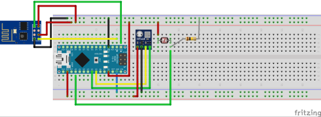

## Introduction
This was originally a way to test out an app I found called ‘Blynk’ which I first tested on the Raspberry Pi. I then decided to try and get it working with an Arduino and a cheap Wi-Fi module then I plugged in my BMP180 and a light sensor and successfully got it working. I then decided to remove the components I was testing it with and turn it into a data logging weather station.

## Wiring



[View on Fritzing](http://fritzing.org/projects/arduino-weather-logger)

## Code
Virtual Pin 1 is Temperature (degC), Virtual Pin 2 is Pressure (Pa).

```cpp
/**************************************************************
 * Blynk is a platform with iOS and Android apps to control
 * Arduino, Raspberry Pi and the likes over the Internet.
 * You can easily build graphic interfaces for all your
 * projects by simply dragging and dropping widgets.
 *
 *   Downloads, docs, tutorials: http://www.blynk.cc
 *   Blynk community:            http://community.blynk.cc
 *   Social networks:            http://www.fb.com/blynkapp
 *                               http://twitter.com/blynk_app
 *
 * Blynk library is licensed under MIT license
 * This example code is in public domain.
 *
 **************************************************************
 *
 * This example shows how to use ESP8266 Shield via Hardware Serial
 * (on Mega, Leonardo, Micro...) to connect your project to Blynk.
 *
 * Note: Ensure a stable serial connection to ESP8266!
 *       Firmware version 1.0.0 (AT v0.22) or later is needed.
 *       You can change ESP baud rate. Connect to AT console and call:
 *           AT+UART_DEF=115200,8,1,0,0
 *
 * Change WiFi ssid, pass, and Blynk auth token to run :)
 * Feel free to apply it to any other example. It's simple!
 *
 **************************************************************/
//#define BLYNK_DEBUG
#define BLYNK_PRINT Serial    // Comment this out to disable prints and save space
#include <ESP8266_HardSer.h>
#include <BlynkSimpleShieldEsp8266_HardSer.h>

#include <Wire.h>
#include <Adafruit_BMP085.h>

// Set ESP8266 Serial object
#define EspSerial Serial

ESP8266 wifi(EspSerial);
Adafruit_BMP085 bmp;

// You should get Auth Token in the Blynk App.
// Go to the Project Settings (nut icon).
char auth[] = "__BLYNK-API-KEY__";

void setup()
{
  // Set console baud rate
  //Serial.begin(9600);
  //delay(10);
  // Set ESP8266 baud rate
  EspSerial.begin(115200);
  delay(10);

  Blynk.begin(auth, wifi, "__SSID__", "__PASSWORD__");
  bmp.begin();
}

void loop()
{
  Blynk.run();
  Blynk.virtualWrite(1, bmp.readTemperature());//temp
  Blynk.virtualWrite(2, bmp.readPressure());//Pressure
}
```

## In the Future
In the future I am planning to put it actually outside (and provide a thumbnail) and possibly improve code or switch to another platform.
