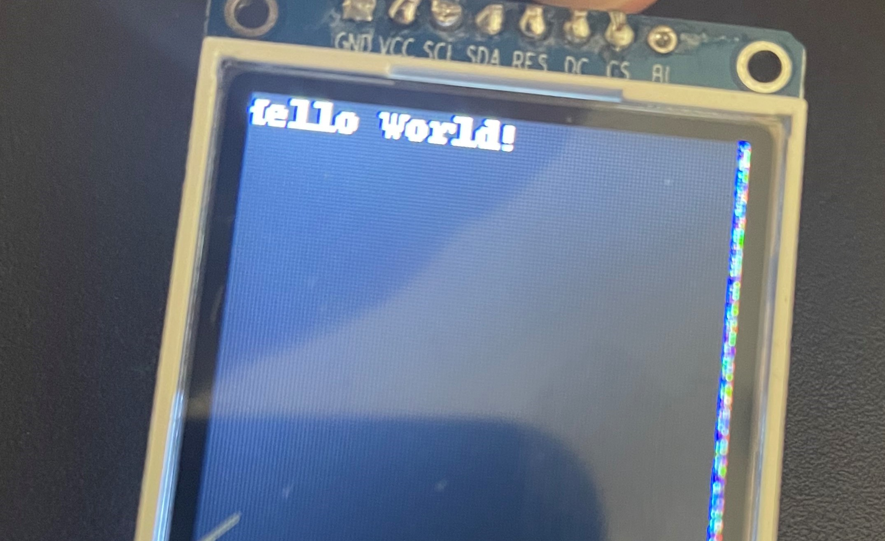

I recently bought a cheap TFT display for a project I was doing and after a bit of research I decided upon a [1.8" 128x160 ST7735 Display](https://www.ebay.co.uk/itm/282469570479) from [Karen's eShop](https://www.ebay.co.uk/usr/karens_e-shop) on eBay, it's very affordable and looked great for my project. On the product page, the seller has got some really great, detailed instructions for getting the screen to work on an Arduino, however, I couldn't find anywhere online for getting this screen to work on a Raspberry Pi. This post will quickly save you the trial and error of getting a ST7735 working with a Raspberry Pi.

## Wiring

Firstly, the display needs to be wired correctly to the Raspberry Pi. [This site](https://pinout.xyz/) will come in handy for finding which pins are where.

| Screen Pin | Raspberry Pi Pin |
| ------ | ------------ |
| GND    | *Ground (pins 6, 9, 14, 20, 25, 30, 34 or 39)* |
| VCC    | *5v Power (pins 2 or 4)* |
| SCL    | GPIO 11 (pin 23) |
| SDA    | GPIO 10 (pin 19) |
| RES    | GPIO 25 (pin 22) |
| DC     | GPIO 24 (pin 18) |
| CS     | GPIO 8 (pin 24) |
| BL     | **Not connected** |

When powering on your Raspberry Pi, the screen will show white by default. You will need to use Python to now display images, more on that below.


## Software

I found a [library](https://github.com/cskau/Python_ST7735) for the screens using the ST7735 chip on GitHub. It is a modified version of a library Adafruit uses for some of their screens. The instructions on the GitHub page are for Python 2 and in this post, I've converted them to Python 3.

Firstly, you need to enable SPI on your Raspberry Pi. You can do this by using the Raspberry Pi configuration tool:

```bash{promptUser: pi}{promptHost: raspberrypi}
sudo raspi-config
```

Once in the configuration, select '3 - Interface Options', then 'P4 - SPI', select 'Yes'

You will also need to download the dependencies required for the library to work:

```bash{promptUser: pi}{promptHost: raspberrypi}
sudo apt update
sudo apt install -y build-essential python3-dev python3-smbus python3-pip python3-pil python3-numpy git
```

Next, you'll need to install the Raspberry Pi GPIO and Adafruit GPIO libraries for Python:

```bash{promptUser: pi}{promptHost: raspberrypi}
sudo python3 -m pip install RPi.GPIO Adafruit_GPIO
```

Afterwards, you can clone the repository and install the library:

```bash{promptUser: pi}{promptHost: raspberrypi}
git clone https://github.com/cskau/Python_ST7735
cd Python_ST7735
sudo python3 setup.py install
```

Finally, you can try out some of the examples in the `Python_ST7735/examples` folder. For example, you can run `python3 shapes.py`.

## Example Code

Here is some example code that I used to print out 'Hello World!' to my display, modified from one of the examples.

```python
from PIL import Image
from PIL import ImageDraw
from PIL import ImageFont

import ST7735 as TFT
import Adafruit_GPIO as GPIO
import Adafruit_GPIO.SPI as SPI

# Set display parameters
WIDTH = 128
HEIGHT = 160
SPEED_HZ = 4000000

# Set display pins
DC = 24
RST = 25
SPI_PORT = 0
SPI_DEVICE = 0

# Create TFT LCD display class
disp = TFT.ST7735(
    DC,
    rst=RST,
    spi=SPI.SpiDev(
        SPI_PORT,
        SPI_DEVICE,
        max_speed_hz=SPEED_HZ),
    width=WIDTH,
    height=HEIGHT)

# Initialize display
disp.begin()

# Clear the display, setting background to black
disp.clear()

# Get a PIL Draw object to start drawing on the display buffer
draw = disp.draw()

# Load default font
font = ImageFont.load_default()

# Write some text
draw.text((0, 0), "Hello World!", font=font, fill=(255, 255, 255))

# Write buffer to display hardware, must be called to make things visible on the display!
disp.display()
```

## Fixing Rainbow Pixels



My display has rainbow pixels around the outside with the above code. This seems to be an issue with a batch of these displays, so it's likely this problem won't affect you. It is due to the image being written onto the screen with a slight offset. There is a forum thread about the issue [here](https://loboris.eu/forum/showthread.php?tid=185).

To fix the issue, you can either:

- make the display's width and height in your code slightly larger. I had to use a width of 130 and height of 161 for my particular display to remove the rainbow pixels.
- use the `disp.set_window(x1, y1, x2, y2)` function. `x1` and `y1` should be the coordinates of the start of your screen, so I know mine is offset by 1 pixel for the width and 2 for the height. Then `x2` and `y2` are where the display ends, so it would be 128 plus your offset and 160 plus your offset respectively. I had no luck fixing mine with this, I'm not sure if the arguments are correct so this might need a bit of experimentation from your part!
