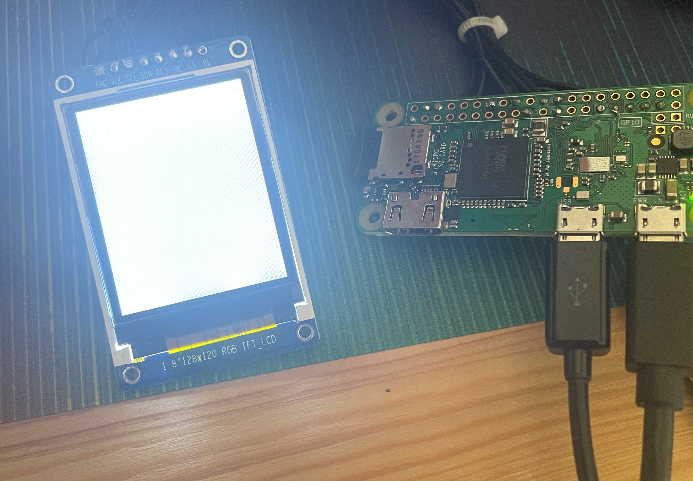

I recently bought a cheap TFT display for a project I was doing and after a bit of research I decided upon a [1.8" 128x160 ST7735 Display](https://www.ebay.co.uk/itm/282469570479) from [Karen's eShop](https://www.ebay.co.uk/usr/karens_e-shop) on eBay, it's very affordable and looked great for my project. On the product page, the seller has got some really great, detailed instructions for getting the screen to work on an Arduino, however, I couldn't find anywhere online for getting this screen to work on a Raspberry Pi. This post will quickly save you the trial and error of getting a ST7735 working with a Raspberry Pi.

## Wiring

Firstly, the display needs to be wired correctly to the Raspberry Pi. [This site](https://pinout.xyz/) will come in handy for finding which pins are where.

| Screen Pin | Raspberry Pi Pin |
| ------ | ------------ |
| GND    | *Ground (pins 6, 9, 14, 20, 25, 30, 34 or 39)* |
| VCC    | *5v Power (pins 2 or 4)* |
| SCL    | GPIO 11 (pin 23) |
| SDA    | GPIO 10 (pin 19) |
| RES    | GPIO 25 (pin 22) |
| DC     | GPIO 24 (pin 18) |
| CS     | GPIO 8 (pin 24) |
| BL     | **Not connected** |

When powering on your Raspberry Pi, the screen will show white by default. You will need to use Python to now display images, more on that below.



## Software

I found a [library](https://github.com/pimoroni/st7735-python) for the screens using the ST7735 chip on GitHub. The instructions and examples on GitHub will work fine, but this is for a different size of the screen, the instructions and example code here will work from the 128x160 display from Karen's eShop.

Firstly, you need to enable SPI on your Raspberry Pi. You can do this by using the Raspberry Pi configuration tool:

```bash{promptUser: pi}{promptHost: raspberrypi}
sudo raspi-config
```

Once in the configuration, select '3 - Interface Options', then 'P4 - SPI', select 'Yes'

Now, you'll need to install the dependencies and the ST7735 library itself:

```bash{promptUser: pi}{promptHost: raspberrypi}
sudo python3 -m pip install RPi.GPIO spidev Pillow numpy
sudo python3 -m pip install st7735
```

## Example Code

Here is some example code that I used to print out 'Hello World!' to my display, modified from one of the examples in the GitHub repository.

```python
from PIL import Image
from PIL import ImageDraw
from PIL import ImageFont

import ST7735

disp = ST7735.ST7735(port=0, cs=0, dc=24, backlight=None, rst=25, width=128, height=160, rotation=0, invert=False)

WIDTH = disp.width
HEIGHT = disp.height

img = Image.new('RGB', (WIDTH, HEIGHT))
draw = ImageDraw.Draw(img)

# Load default font.
font = ImageFont.load_default()

# Write some text
draw.text((5, 5), "Hello World!", font=font, fill=(255, 255, 255))

# Write buffer to display hardware, must be called to make things visible on the
# display!
disp.display(img)
```
