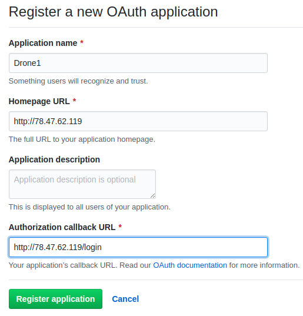
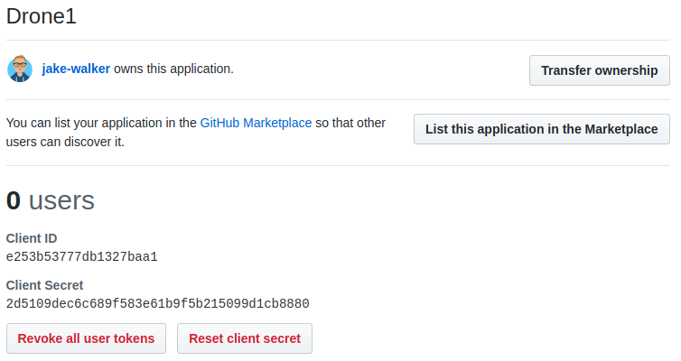
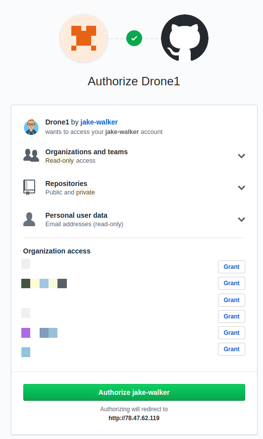
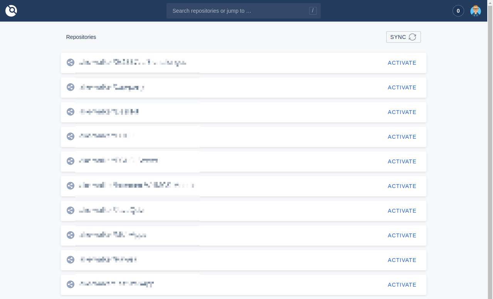
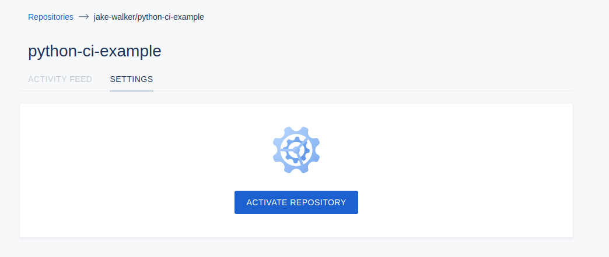
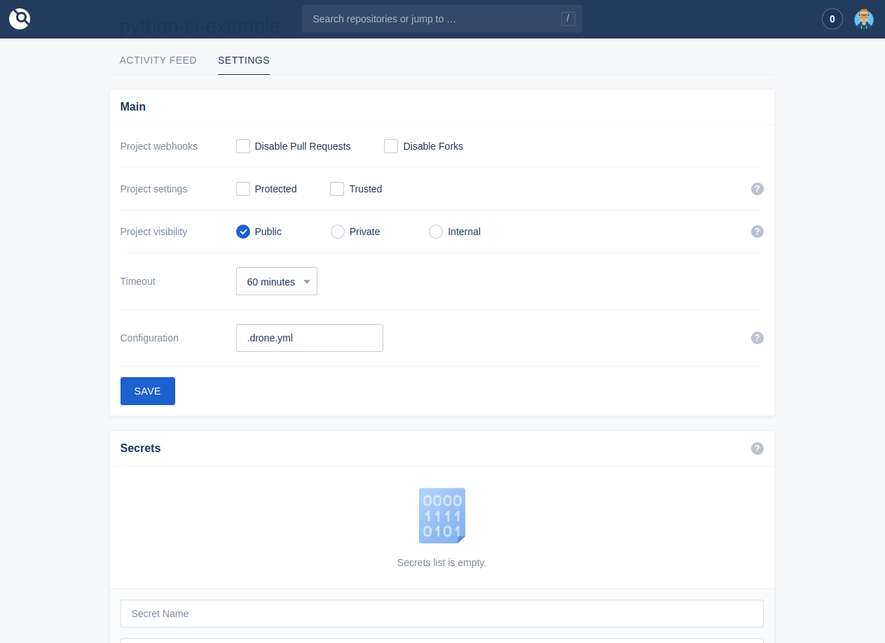
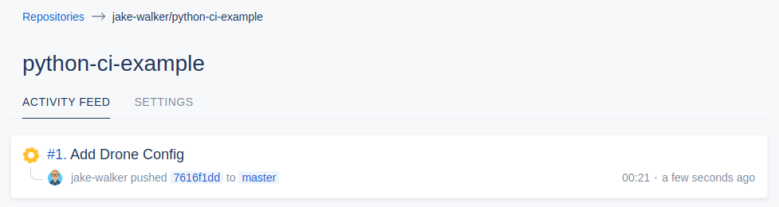
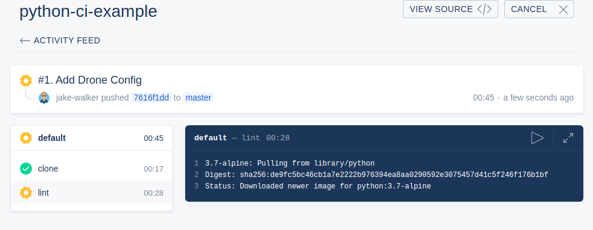
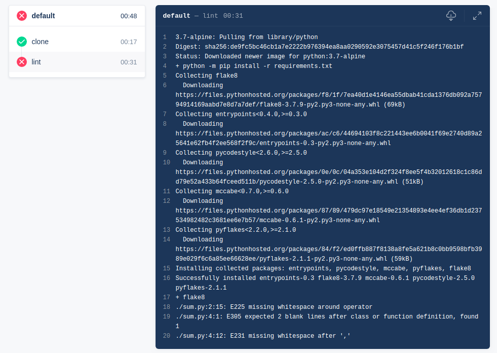
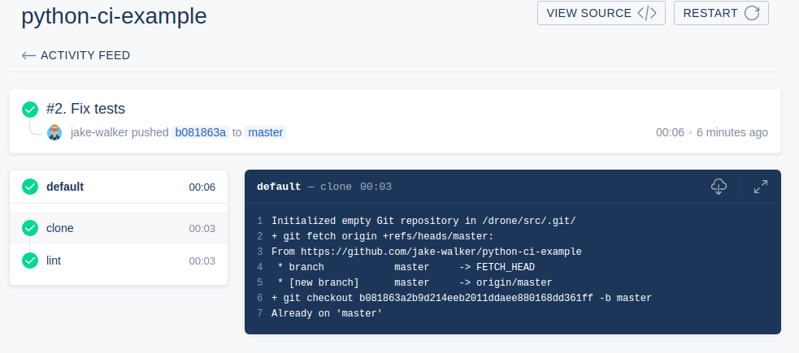

In the past month, I have been playing around with [Drone](https://drone.io/) which is probably my new favourite CI tool! In this article, I'm going to talk about why I like it so much and how you can use it to test your own code.

Lots of code projects will have tests (which are small functions that test a section of the project to check that it is working as intended). It would be very time consuming for maintainers of a project to keep running these tests after contributors have changed it, so this job can be automated using continuous integration. CI tools can detect when code has been changed, run all of the tests, alerting the project maintainers if there are any problems.

As I mentioned before, Drone is one of these tools that automatically runs tests. However, there are many other tools like this available, such as [Jenkins](https://jenkins.io/), [Travis CI](http://travis-ci.com/) and the new [GitHub Actions](https://github.com/features/actions). Lots of these have their advantages and some are more specialized for specific use cases, so if you don't feel like Drone is for you, maybe do some research!

## Why Drone?

Unlike the majority of CI tools, Drone uses [containers](https://www.docker.com/resources/what-container) to run it's tests. This is a huge benefit because once the test is run, everything that was changed in the container is gone, so there are no changes to the host's operating system.

I also like Drone because of how simple it is to get up and running as well as how easy it is to setup a testing pipeline (as we'll see later in this post).

The last point I like about Drone is that you host it all yourself. Travis CI and GitHub Actions are hosted which means that the company manages the infrastructure, not you. This does have it's advantages with excellent uptime and an 'it just works' experience. However, once you need to start needing building closed source projects or have large or lots of projects, you start running into problems with pricing. As with Drone you're always in control of your own infrastructure, you can always scale up when you need to build more simultaneous projects and you will probably be paying less than buying a hosted CI.

## Setting up Drone

Drone is run inside [Docker](https://opensource.com/resources/what-docker) which there are only a couple of commands to get it up and running. I'll be showing how you install it on a fresh Ubuntu server, but these commands should work on most major Linux distributions and even on a VM or spare computer.

_Specifically, I'm using a CX11 instance from [Hetzner Cloud](https://www.hetzner.com/cloud) running Ubuntu Server 18.04. On the server where I run my main instance of Drone, I also run other applications with no problems._

You'll need a server with a public IP address, there are no minimum requirements to run Drone, but I'd recommend at least 1 GB of RAM and 1 CPU core. _At idle, both the server and runner use about 15MB RAM and little CPU, so extremely lightweight._

### Installing Docker

The quickest and easiest way to install Docker is using their installer script. This script works on most major Linux distros (even Raspbian). **Make sure you run this as root!**

```shell
curl -fsSL https://get.docker.com -o get-docker.sh
sh get-docker.sh
```

If you have any ordinary user accounts that you'd like to be able to use Docker, you can use this command to give them permission to do so:

```shell
sudo usermod -aG docker username
```

### Installing Drone

Next up, installing Drone itself. Drone is installed differently depending on which provider you use for your source code (at the moment GitHub, GitLab, Gitea, Gogs, Bitbucket Cloud, Bitbucket Server are supported). I'm going to be setting up a GitHub instance, but if you want to setup something else take a look at the relevant installation instructions [here](https://docs.drone.io/installation/providers/).

1. **[Create a OAuth Application](https://github.com/settings/applications/new) on GitHub.** For the application name, put something like 'Jake's Drone', for homepage URL, put the URL of where you will be hosting your Drone instance whether it's an IP address or domain name (e.g. `http://drone.example.com/` or `http://10.20.30.40`) and finally for the Authorization URL put the domain of your drone instance plus `/login` at the end (e.g. `http://drone.example.com/login` or `http://10.20.30.40/login`). After that, take a note of the client ID and client secret that you get.

    Here's the information for my instance when creating the OAuth application:
    

    And here's the client ID and secret that we get:
    
1. Now we need a secret code will be used for encrypting communications between the runner (which we'll get onto later) and the server. Run this command to get a suitable key:
    ```shell
    openssl rand -hex 16
    ```
1. And now we need to download Drone through Docker, we need to use the command:
    ```shell
    docker pull drone/drone:1
    ```
1. Finally, we are going to start up the Drone server through Docker with this command. Make sure to substitute all of the placeholders in angle brackets `<>`:
    ```shell
    docker run --volume /var/lib/drone:/data --env DRONE_AGENTS_ENABLED=true --env DRONE_GITHUB_SERVER=https://github.com --env DRONE_GITHUB_CLIENT_ID=<GITHUB_CLIENT_ID> --env DRONE_GITHUB_CLIENT_SECRET=<GITHUB_CLIENT_SECRET> --env DRONE_RPC_SECRET=<SECRET_KEY> --env DRONE_SERVER_HOST=<YOUR_DOMAIN_OR_IP> --env DRONE_SERVER_PROTO=http --env DRONE_USER_CREATE=username:<YOUR_GITHUB_USERNAME>,admin:true --env DRONE_USER_FILTER=<YOUR_GITHUB_USERNAME> --publish=80:80 --publish 443:443 --restart=always --detach=true --name drone drone/drone:1
    ```

That's a long command right! Here's a breakdown of what the different parameters are doing:

<details>
  <summary>Parameter explanations</summary>
  <ul>
    <li><code>--volume /var/lib/drone:/data</code> tells Docker to permanently store the folder <code>/data</code> in the container to <code>/var/lib/drone</code> on the host. If this wasn't set, whenever the container is restarted, data might be lost and we'd have to setup Drone again.</li>
    <li><code>--env ...</code> tells Docker to set an environment variable inside of the container. It's a way of giving the application inside the container some basic configuration.</li>
    <ul>
    <li><code>DRONE_AGENTS_ENABLED=true</code> sets that we want the server to communicate with the agents/runners that we'll setup later.</li>
    <li><code>DRONE_GITHUB_SERVER=https://github.com</code> tells Drone which GitHub we are talking to (this would change if you were hosting your own GitHub Enterprise instance, but for most people we just want to be talking to the normal GitHub)</li>
    <li><code>DRONE_GITHUB_CLIENT_ID=...</code> is used for handling authentication with GitHub, allowing users to login with their GitHub credentials to Drone.</li>
    <li><code>DRONE_GITHUB_CLIENT_SECRET=...</code> same as above.</li>
    <li><code>DRONE_RPC_SECRET=...</code> is a secret key that is used for the server when communicating to the runners and vice-versa.</li>
    <li><code>DRONE_SERVER_HOST=...</code> is the place where the Drone instance is being hosted.</li>
    <li><code>DRONE_SERVER_PROTO=http</code> tells Drone whether we are using HTTP or HTTPS. It makes sure that all of the links that it uses are either HTTP or HTTPS.</li>
    <li><code>DRONE_USER_CREATE=username:...,admin=true</code> will make sure that our GitHub account is an adminstrator of the Drone instance. It will allow you to use the Drone CLI with your account to do things with the server.</li>
    <li><code>DRONE_USER_FILTER=...</code> only let's this list of users to make accounts, if you want to add more you can separate the list with commas (e.g. <code>bob,jeff,alex</code>)</li>
    </ul>
    <li><code>--publish=80:80</code> tells Docker that any traffic coming in or out of port 80 on the host should be forwarded to port 80 inside the container.</li>
    <li><code>--publish=443:443</code> is the same as above but for port 443 which is HTTPS.</li>
    <li><code>--restart=always</code> makes sure that the container is kept running all the time. If this wasn't set and the server was rebooted, the Drone server would not automatically start, additionally, if the Drone server crashes it will be restarted automatically.</li>
    <li><code>--detach=true</code> makes this container run in the background.</li>
    <li><code>--name drone</code> gives this container a name, useful for running any commands on the container (e.g. <code>docker logs drone</code> will get the logs of the container).</li>
    <li><code>drone/drone:1</code> tells Docker which image that should be used for this container.</li>
  </ul>
</details>

OK, now you've got a _hopefully_ working Drone server! Open up your favourite web browser and head over your your server's IP address.

You'll be redirected to a GitHub authorization page:



And then you'll get a list of your repositories after a couple of seconds:



You can click the 'Activate' button by any of your repositories to let Drone build them automatically, but nothing will happen without a runner.

### Creating a Drone Runner

To make the Drone instance functional, we need a runner. This is a small application that runs all of the tests that we define in our project. We'll be setting up a Docker runner which runs the tests inside Docker containers (you can also get a Kubernetes Runner, Exec Runner (runs commands inside a shell on a host), SSH Runner (runs commands on a remote host) and Digital Ocean Runner (runs tests inside a fresh Digital Ocean server)). There are reasons why you might want to use a different type of runner, so you might want to research which one might be best for you and your project, however the Docker runner will work best for the majority of projects if you are just building on Linux. You can read the installation instructions for all of the different runner types [here](https://docs.drone.io/installation/runners/).

> For Windows builds, an Exec runner is the best to use as Docker is a bit janky on Windows.

These instructions are for installing the Docker runner on Linux. It does not need to be run on the same server as the Drone server, but I will be doing that.

1. Download the runner image through Docker:
    ```shell
    docker pull drone/drone-runner-docker:1
    ```
2. Run the runner:
    ```shell
    docker run -d -v /var/run/docker.sock:/var/run/docker.sock -e DRONE_RPC_PROTO=http -e DRONE_RPC_HOST=<YOUR_DRONE_INSTANCE_DOMAIN_OR_IP> -e DRONE_RPC_SECRET=<SECRET_KEY_FROM_INSTALLING_DRONE_SERVER> -e DRONE_RUNNER_CAPACITY=2 -e DRONE_RUNNER_NAME=${HOSTNAME} -p 3000:3000 --restart always --name runner drone/drone-runner-docker:1
    ```

The parameters have the same meanings as when we installed the Drone server. `DRONE_RUNNER_CAPACITY` tells the server how many things can be built at once, unless you will be building lots of projects at the same time `2` is a good value to go for.

Now we are ready to build something!

## Using Drone

To demonstrate how Drone works, I'm going to walk through how to setup a project to test. You should be able to follow along with this demonstration as all of my code is available [here](https://github.com/jake-walker/python-ci-example/), I'll link to the specific version of the repository that I'm at throughout this section.

### The Test Subject

I don't want to go much into coding with this blog post, but I'll be testing a simple Python application:

**sum.py**
```python
def sum(a, b):
    return a +b

print(sum(4,6))
```

So in this example, I'm using the Python library `flake8` to test that my code is conforming to a set of nice styles. I've purposely formatted my code badly so that the tests will not pass.

To use this code on my own computer, I'll need to:

1. Install the Python libraries that I'm using: `python -m pip install -r requirements.txt`
2. Run flake8 to check for errors: `flake8`

With the code above, I'm getting 3 errors from flake8 on my computer:

```text
➜ flake8
./sum.py:2:15: E225 missing whitespace around operator
./sum.py:4:1: E305 expected 2 blank lines after class or function definition, found 1
./sum.py:4:12: E231 missing whitespace after ','
```

OK, now that I've got something to test, I'm going to commit my code to GitHub. Take a look at my [commit here](https://github.com/jake-walker/python-ci-example/tree/026b0c8a9ed7890a1f5d200b88ae80a104451d96).

### Activating the Repository

Now let's head over to Drone and activate that repository:



After clicking Activate, you'll get the settings of your repository:



Here you can set:

- **Project Webhooks** where you can configure to disable checking for pull requests or forks of your repo.
- **Project Settings** where you can set:
    - **Protected** - let's you sign your build configuration and don't run it unless it is signed. Read more [here](https://docs.drone.io/configure/signature/).
    - **Trusted** - let's your Docker containers run in privileged mode, which allows them to have unlimited access to the host.
- **Timeout** - the time for one build before Drone goes "Welp, this isn't going to finish. Might as well stop".
- **Configuration** - the name of the file to look for instruction in (we'll come onto this later).
- **Secrets** - variables that can be used in your test which you don't want people to see (e.g. passwords).
- **Cron Jobs** - running tests on a regular schedule (e.g. hourly, daily, weekly, monthly)
- **Badges** - little status icons that you can add onto your repository.

You might have noticed under the 'Activity Feed' tab that nothing has happened since we have added this repository. That's because we actually haven't told Drone what to do with all of this code. Let's make a configuration file to do so.

### Creating a Pipeline

Back in our code we'll make this simple config file with all of the instructions that we need. I'm not going to go over every single option you can put in this config file so you can have a look at the extra awesome things you can do [here](https://docker-runner.docs.drone.io/configuration/).

**.drone.yml**
```yaml
---
kind: pipeline
type: docker
name: default

steps:
  - name: lint
    image: python:3.7-alpine
    commands:
      - python -m pip install -r requirements.txt
      - flake8
```

This file is pretty small right? Here's what everything means:

- `kind: pipeline` - I'm not totally sure what else this would be, but this tells Drone that we are defining a new pipeline.
- `type: docker` - This tells Drone to run this pipeline on a Docker runner.
- `name: default` - This is the name of the pipeline, this can be anything really.
- `steps:` - This is the list of instructions that are executed **in order** to test the code.
- `- name: lint` - The hyphen at the start indicates a new 'step' block. Also in this line we are defining the name of this step, this can also be anything.
- `image: python:3.7-alpine` - This is the Docker image that is going to be used for building this code. This particular image `python:3.7-alpine` has Python pre-installed.
- `commands:` is a list of commands that should be executed in this step
- `python -m pip install -r requirements.txt` this runs that exact command inside the container which installs all of the extra packages that we need for the program to run (this would be specific to your project)
- `flake8` is the command that tests our code.

So how does Drone know that the test failed? Every command on Linux has an exit code which can be any number. If the command finishes successfully the command sends an exit code of `0`, otherwise it might give an exit code of `1`. Any code which isn't `0` indicates the command didn't run successfully, and hence Drone can tell whether the test fails. Any commands that fail in the `commands` section of the config will stop the test and mark it as a failure.

After [committing this config file](https://github.com/jake-walker/python-ci-example/tree/7616f1dd6a5f408fe13c0a18702f45525ca91c45), Drone will actually start running the test. If you look at Drone now you'll be able to see the test running:



And when we click on the test above, we can see the separate steps (along the sidebar) that this build contains and whether they have failed or passed. The yellow cog shows that the `lint` step is in progress:



Oh no! Our test has failed:



If you take a look closer, we are getting the same output as I got when I ran the test command on my computer.

OK now that we know that our test fails properly, [let's fix the code](https://github.com/jake-walker/python-ci-example/tree/b081863a2b9d214eeb2011ddaee880168dd361ff). After committing the changes, we can see that Drone starts another build and it passes!



## Wrapping Up

So hopefully I've been able to show you how Drone is so awesome and how to use it. Even if you don't have a server to host your own instance of Drone, you can still use their **free**, **hosted** one [here](https://cloud.drone.io/), or alternatively you could use a similar CI tool which is free and hosted (such as [GitHub Actions](https://github.com/features/actions) (which also uses containers, but different config files) and [Travis CI](http://travis-ci.com/)).

If you need any help setting up your own instance or making config files or anything like that, don't hesitate to [ask me for help](https://jakew.me/contact/)! Thanks for reading :)
