I'm part of a club in my Sixth Form called [CADS](https://cadscheme.co.uk/) which among other things, involves learning about soft skills and cyber skills and applying those in the real world. Next week, we are attending an event where we are trying to spread awareness about Cyber Security and to achieve that we have decided to do a couple of demonstrations.

I am in charge of setting up a demonstration about [WannaCry](https://en.wikipedia.org/wiki/WannaCry_ransomware_attack) which is a [ransomware](https://en.wikipedia.org/wiki/Ransomware) attack that targets Windows computers using an exploit called [EternalBlue](https://en.wikipedia.org/wiki/EternalBlue). It's the one that was prominent in the news during 2017 when it hit the UK's NHS and took down a lot of their computer network. You can read up some more about WannaCry on the [Wikipedia page](https://en.wikipedia.org/wiki/WannaCry_ransomware_attack).

## Research

There are samples of malware (like WannaCry) available online to allow security researchers to reverse engineer them to find out how they work, how they can stop them and to add them to their anti-virus databases. During my research, [theZoo on GitHub](https://github.com/ytisf/theZoo) seemed to be a great place for finding these malware samples.

It is important to setup a safe environment for running the WannaCry sample. After doing some research from multiple sources, I found that the best way to run the sample of malware would be within a virtual machine with no internet connection and some extra settings to ensure that it is isolated from the host machine. I was also planning to use snapshots of the virtual machine so that it could easily be reset to a working version of Windows after it has been infected with the ransomware.

Unpatched Windows XP and Windows 7 machines are vulnerable to WannaCry so I would need to use one of those operating systems. In the end I decided to go for Windows 7 because it's slightly newer and WannaCry works better on Windows 7 according to the [Wikipedia page](https://en.wikipedia.org/wiki/WannaCry_ransomware_attack#Attack). I found an Windows 7 disc which was older than 2016 so it wouldn't be patched against the EternalBlue exploit.

## Setup

Now that I had completed my research, I was ready to create a virtual machine for running WannaCry safely.

### Setting up the Virtual Machine

I am using [VMware Workstation 15 Pro](https://www.vmware.com/uk/products/workstation-pro.html) for creating the virtual machine, but [VirtualBox](https://www.virtualbox.org/) would also work fine and can also create snapshots of virtual machines.

I started off by creating a new Typical Virtual Machine:

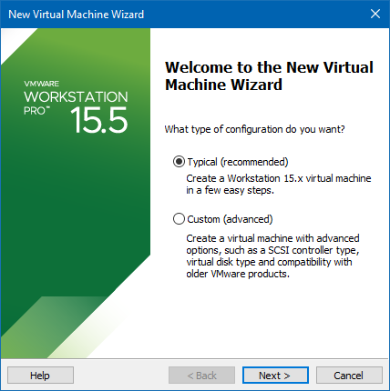

Then although I had in ISO file to use, I picked 'I will install the operating system' later so that VMware didn't use it's Easy Install feature which skips through the installation wizard.

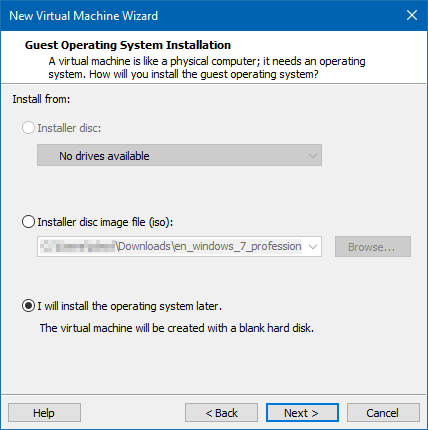

Next up, I picked the version of Windows that I was using:

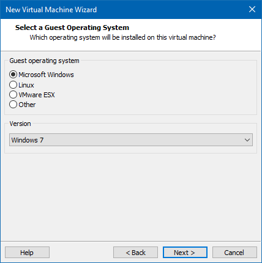

And gave it a name

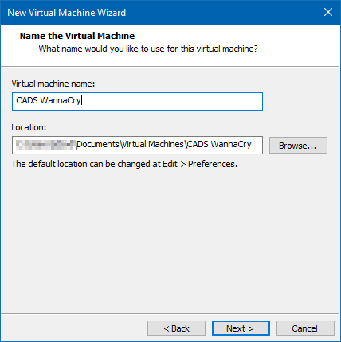

Then I created the virtual hard drive. The recommended size is 60 GB, but I decided to go for half of that as I wouldn't be doing anything other than copying some files into the VM and running WannaCry.

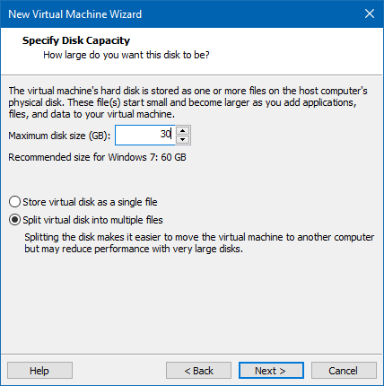

Then I needed to give the VM slightly more processor, RAM and setup the ISO to be in the virtual machine's CD drive by clicking 'Customize Hardware...':

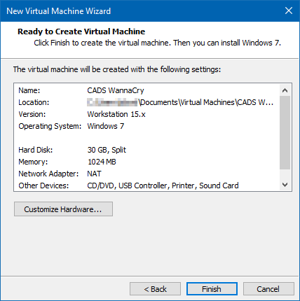

In the Memory tab, I increased the memory from 1024 MB to 2048 MB:

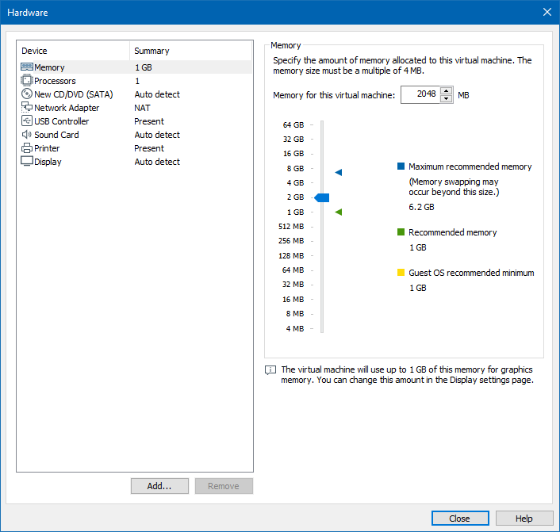

In the Processors tab, I increased the number of processors from 1 to 2:

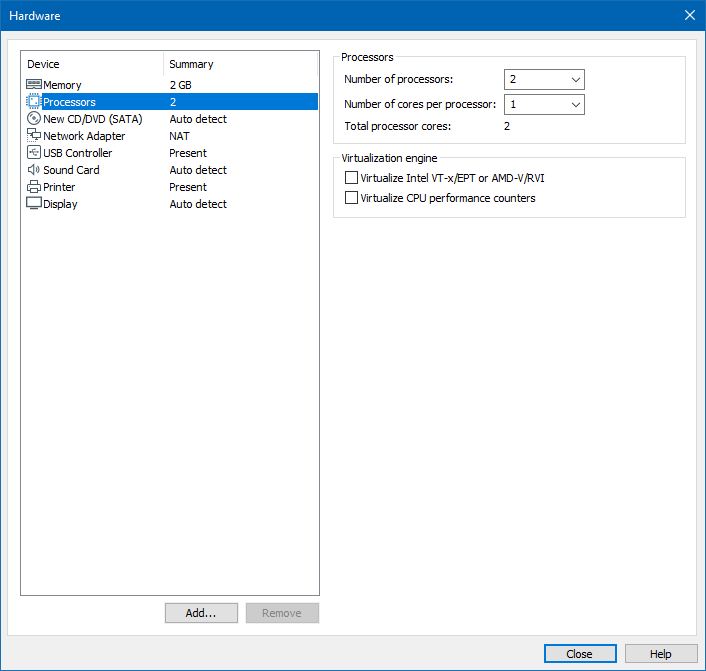

Then I removed the Network Adapter by selecting it and hitting the remove button at the bottom of the menu.

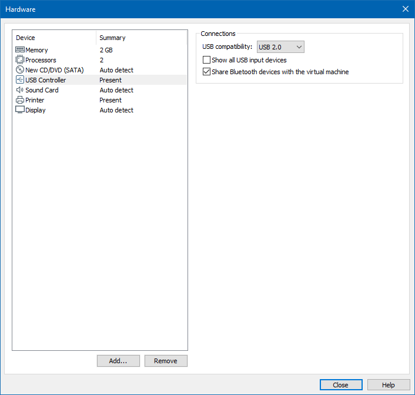

Then on the 'CD/DVD (SATA)' tab, I selected the 'Use ISO image file' and opened the ISO image that I had for Windows 7:

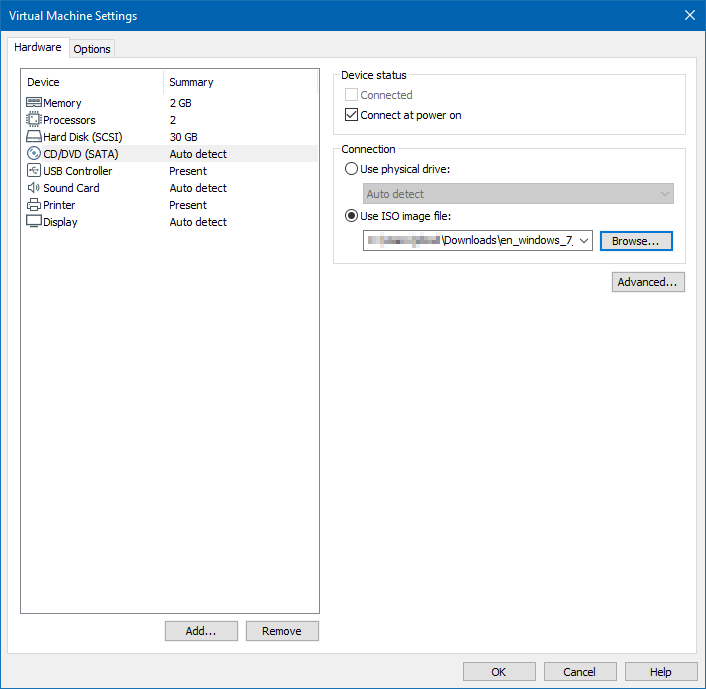

Finally, I checked over the new VM's settings and hit Finish:

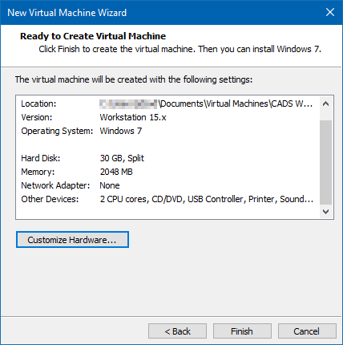

### Setting up Windows

After creating the virtual machine, it was time to setup and install Windows 7. The ISO image was already mounted to the VM from the previous steps, so it is ready to boot.

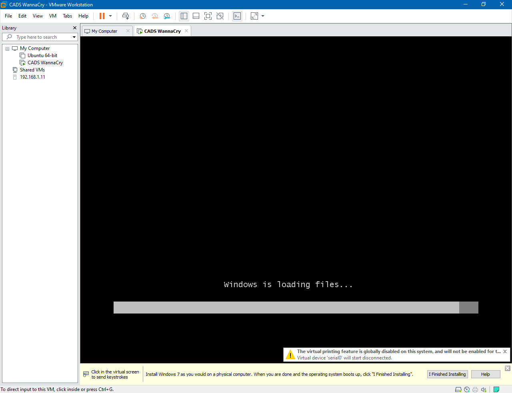

Then I just went through the setup wizard as on a normal computer.

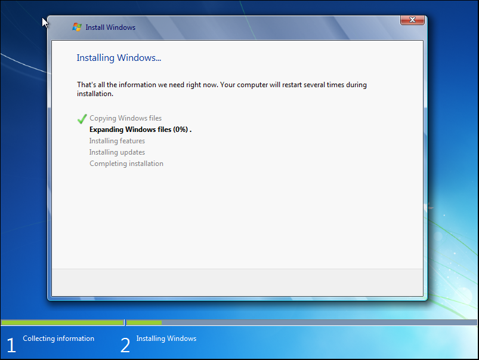

I created a new user called 'CADS' and gave it a suitable name:

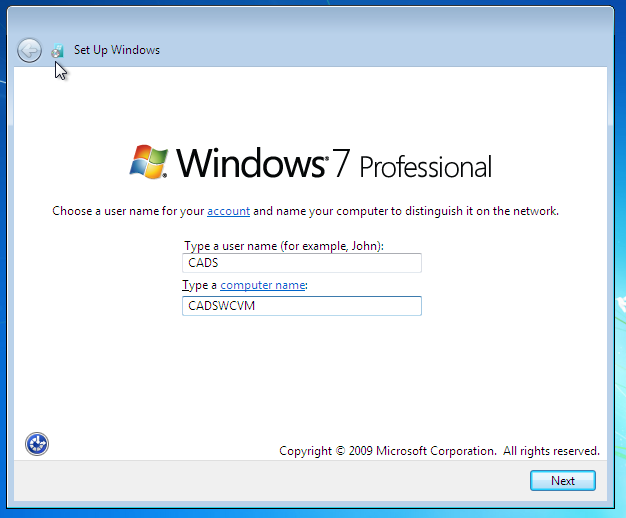

I clicked next when it asked for a product key as it doesn't matter that this VM isn't activated. Then I selected 'Use recommended settings' and set my time zone, date and time. Then I was greeted with the Windows 7 desktop. At this point, it's a good idea to make sure that the virtual machine **does not** have an internet connection.

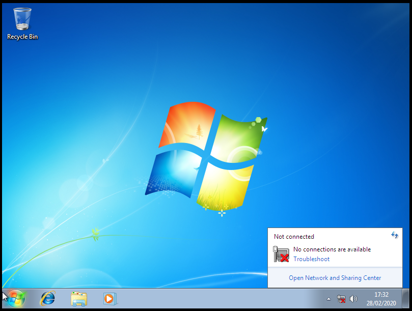

From my earlier research, it is recommended that you **don't** install VMware tools, so if you are prompted by VMware to add them, it's best to ignore the message.

One of the downsides of not installing VMware tools is that the screen is tiny. As I'm doing a demonstration I can't really use it with a tiny screen resolution. I fixed this by going into the settings and changing the screen resolution and also turning on screen stretching in VMware so that it would scale the screen to the size of the window.

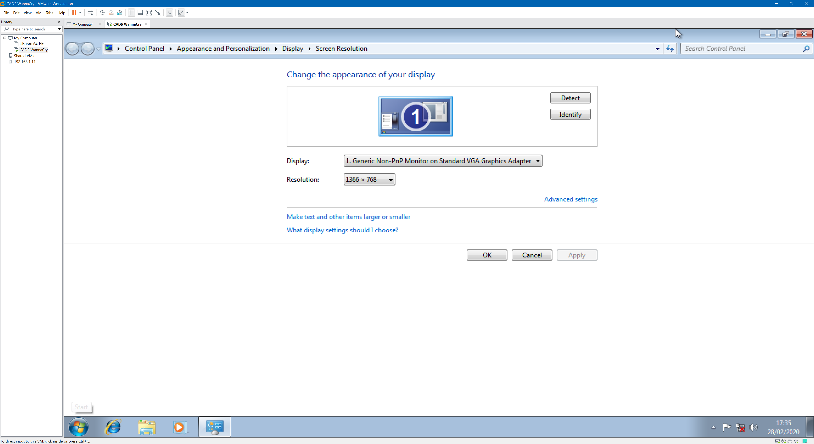

I then customised Windows 7 a bit by adding a wallpaper, user avatar and adding some random files to the desktop, documents and pictures folders which would demonstrate the files getting encrypted. I copied all of the things I'd need on the virtual machine to a USB drive plugged into my host machine.

I then attached the USB drive to the virtual machine and copied all of the files off to their relevant places:

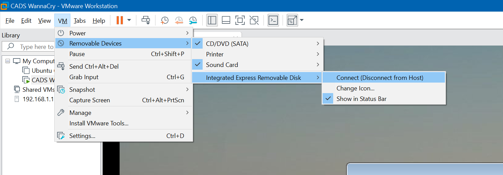

## Malware Sample

Now that the virtual machine is setup, it's time to download the malware sample and copy it into the virtual machine.

To download the sample, I went to [theZoo on GitHub](https://github.com/ytisf/theZoo/tree/master/malwares/Binaries/Ransomware.WannaCry) on my host machine and went into `malwares` → `Binaries` → `Ransomware.WannaCry` and then downloaded the `Ransomware.WannaCry.zip` file.

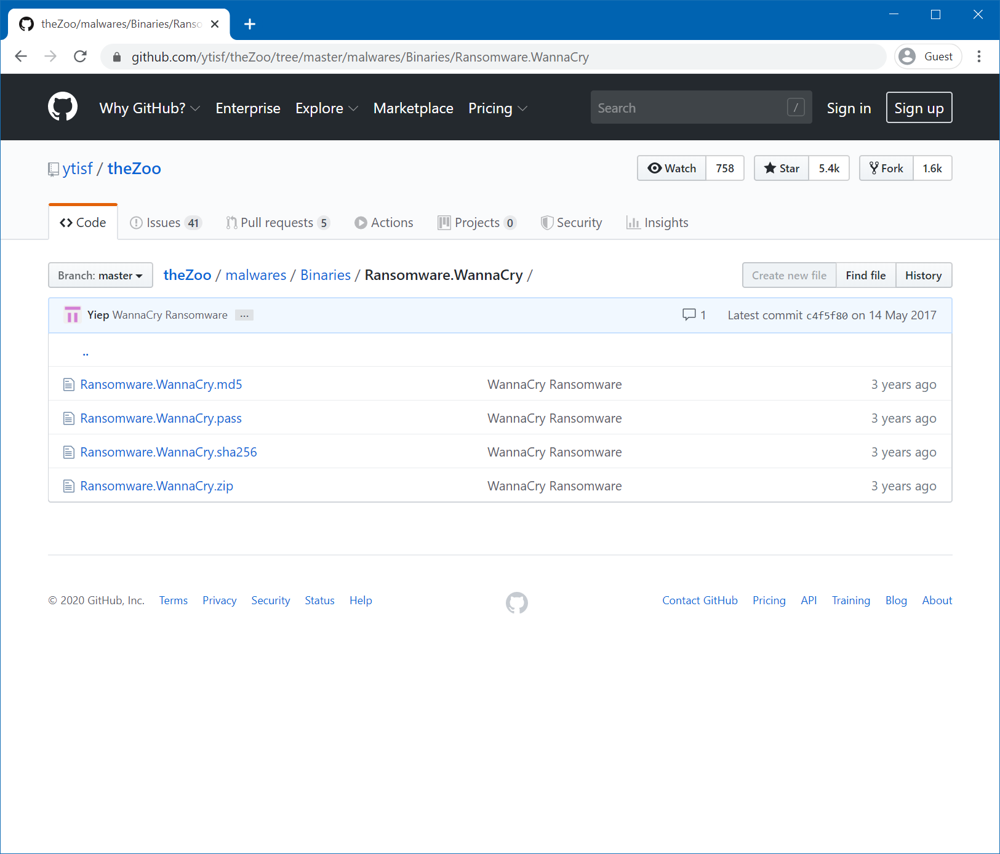

After downloading, Windows Defender should immediately detect that you have just downloaded malware and quarantine it.

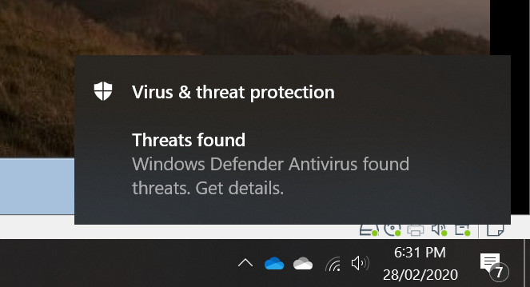

We need to allow the malware to be on our host computer. The malware is safe as long as it is inside the ZIP file. To do this, open up Windows Defender and find where the threat has been blocked and hit the allow button:

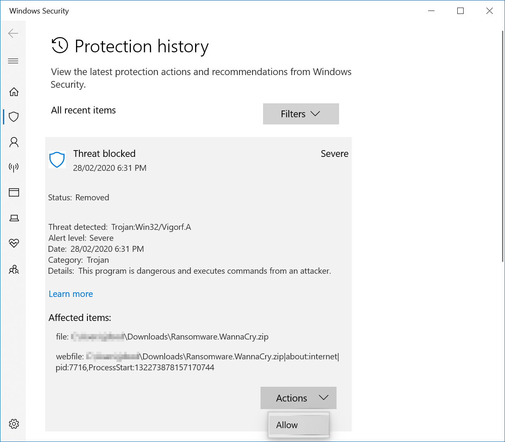

Now that it is allowed, we can copy it onto the USB drive like with the other files (you might need to disconnect it from the virtual machine for it to show up on the host machine). Then connect the USB drive back to the virtual machine and copy the newly downloaded file onto the desktop (or another convenient folder).

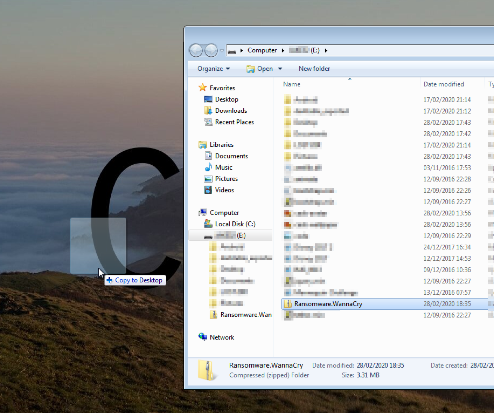

Now disconnect the USB drive from the virtual machine. It's best not to unzip the malware until it is about to be used.

## Snapshot

It's a good idea to take a snapshot of the virtual machine at this point. A snapshot is a 'copy' of the virtual machine at it's current state with all of it's files and settings. Doing this will allow us to restore a snapshot after we have executed the malware.

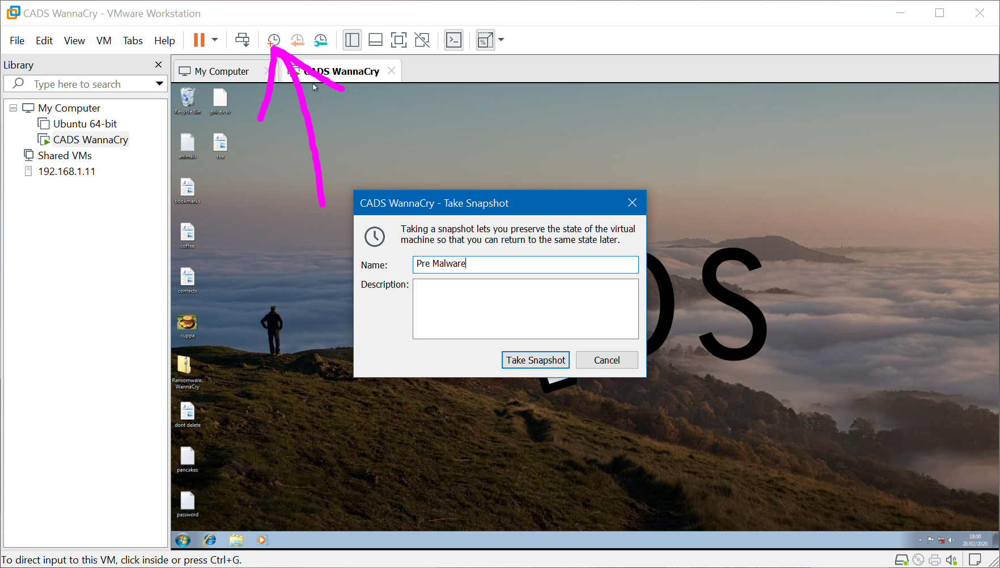

Give the snapshot a suitable name and then hit 'Take Snapshot'. At the bottom of VMware, there will be a percentage of the progress of the snapshot (e.g. 'Saving state... 42%'). Ensure that you wait until this message has disappeared before continuing. It's also best to not use the virtual machine whilst it is saving a snapshot.

## Final Checks

Now that the virtual machine is loaded with the malware and we have a snapshot of before the malware is executed, it is worth shutting down the virtual machine and checking the settings. Shut down the virtual machine by shutting down Windows 7 as normal.

Go into the menu for editing the virtual machine's settings in VMware and double check the following:

- There is no **network adapter**. If there is one, make sure that it has been removed.
- There is no **CD/DVD drive** or **printer**. Although this isn't important to remove, it's best to remove all of the ways that the malware could escape the virtual machine.
- In the 'Guest Isolation' tab, uncheck 'Enable drag and drop' and 'Enable copy and paste'.

Then hit 'Save'.

## The demonstration

Boot the virtual machine back up and double click on the `Ransomware.WannaCry.zip` file on the Desktop and unzip the EXE that is contained inside. The password for unzipping is on the GitHub download page.

Then simply double click on the EXE to start WannaCry and watch the carnage.

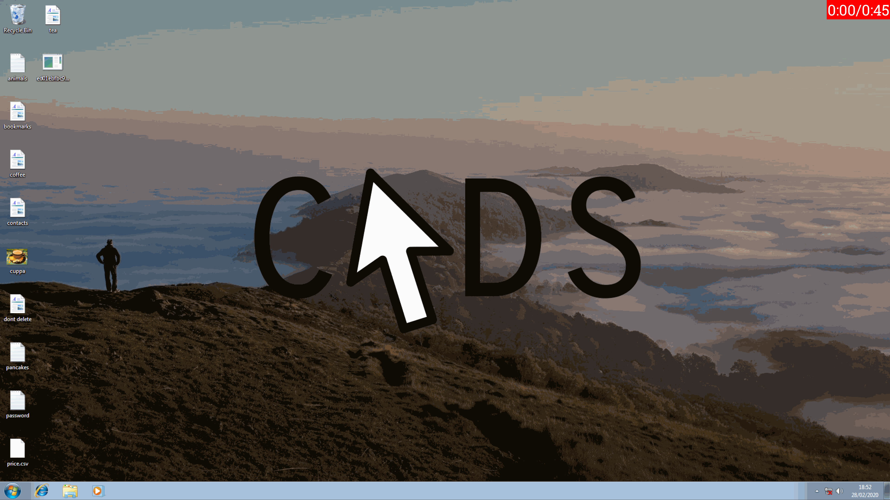

Then to reset the virtual machine, click the restore snapshot button at the top of the window and wait for a couple of seconds.

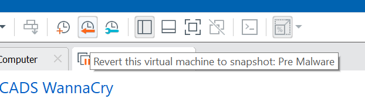

## Improvements

For the final demonstration at the event, I am planning on having a host-only network between two virtual machines so that I can show the malware spreading through a network of computers.

## Wrapping Up

Hopefully this has been a small introduction on how to safely run malware on your own computer using a virtual machine. From here, you can do some analysis on the running malware using tools like [Wireshark](https://www.wireshark.org/download.html) to check network activity, [Volatility](https://github.com/volatilityfoundation) to look inside memory or [Regshot](https://www.howtogeek.com/198679/how-to-use-regshot-to-monitor-your-registry/) for comparing the registry before and after executing the malware.

Thanks for reading :)
