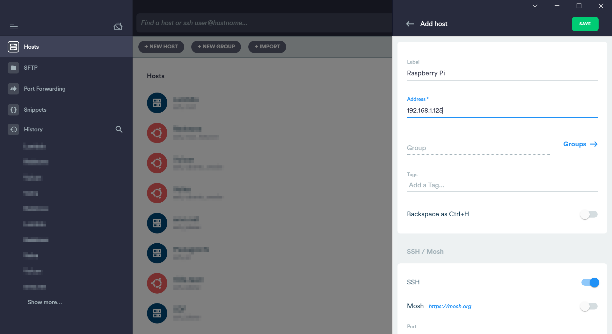

I often find myself setting up a Raspberry Pi and I always forget the right way to set it up headlessly (without anything plugged in but power) so I thought I'd write a quick post about how I end up setting them up.

Although, I'm referring to a Pi Zero W for this post, these same instructions can be applied to any Raspberry Pi with a built-in Wi-Fi adapter or a compatible USB Wi-Fi adapter.

## Choosing an SD Card

Unlike most other things, it's quite important to have a good quality SD card for your Raspberry Pi. I have a small collection of ones that work fine in Raspberry Pis but if you're looking for a new one it's good to look out for:

- **Class**. SD cards are given a class which summarises what kind of speeds you should expect to get from the SD card. Most places online recommend a class of 10 or higher. The SD card that I have below is class 10 (which you can see by the 10 in the small circle).
- **Size**. SD cards also come in a variety of sizes. 8GB is the recommended minimum for Raspbian but you could possibly fit it all on a smaller SD card.


## Flashing the SD card

The next step is to install the operating system onto the SD card. For this step you'll need a separate computer.

Raspberry Pi have recently released a new tool called 'Raspberry Pi Imager' that simplifies the process of flashing SD cards with the operating system.

Firstly, you'll need to download the Raspberry Pi Imager for your specific operating system, you can find all of the links at the top of the [Raspberry Pi Downloads Page](https://www.raspberrypi.org/downloads/).

After you've downloaded the imager, install and launch it:


The next step is then to select which operating system you would like. There are many different official varieties. Most of the time you'll just want ordinary Raspbian which is the first item in the list.


As I'm walking through a headless setup, I'd recommend using Raspbian Lite which has no desktop (just a command line). You can find this by clicking 'Raspbian (other)' and then selecting 'Raspbian Lite'.


The next step is to connect the SD card that you want to flash. There might be only one device to choose from, but if not make sure that you are selecting one with a similar size to your SD card (it might not be exactly the same, mine shows up as 7GB in the list even though it is 8GB).


Finally, after selecting the operating system and SD card, you can hit the write button and wait.


It could take a couple of minutes to download the image and flash it depending on your internet speed.

## Setting up headless

At this point, you could stop and plug in the SD card to your Raspberry Pi with a screen, keyboard and mouse and use it as usual. Or, you could add a couple of files to the SD card to make the Raspberry Pi connect to your Wi-Fi network and start SSH (which both would normally require you to configure manually).

The Raspberry Pi Imager automatically ejects the SD card after it has been flashed so you might need to unplug and plug back in your SD card in order to see the files stored on it.


### Enabling SSH

Open up the 'boot' drive that shows up and in Windows you can hold down <kbd>Shift</kbd> while right-clicking to bring up a menu with the option 'Open PowerShell window here':


On Windows, you can then type the command `echo $null >> ssh` to create a blank file called 'ssh'. On Linux and MacOS, you can use the command `touch ssh` in order to create the same blank file.


Creating a blank file called 'ssh' tells Raspbian to enable SSH.

### Wi-Fi

The next step is to enable Wi-Fi on the Pi. This can be done by creating a new file called 'wpa_supplicant.conf'.

Make a new blank file in your text editor of choice, ensuring that line endings are set to 'LF', then copy the text below into the file:

```plain
ctrl_interface=DIR=/var/run/wpa_supplicant GROUP=netdev
update_config=1

network={
    ssid="network"
    psk="password"
}
```

Replace 'network' with your Wi-Fi network's name and 'password' with your Wi-Fi network's password. Then save the file as 'wpa_supplicant.conf' to the root of the SD card.


After doing both of those steps, you should now have 2 new files in the root of the SD card like so:


## Booting Up

Now you're good to pop the SD card into the Raspberry Pi and connect power.


Then you can use an app like [Fing](https://www.fing.com/products/fing-app) to scan your Wi-Fi network for a Raspberry Pi. Looking at the app, I found that my Pi's IP address is 192.168.1.125.


## Connecting via SSH

To connect via SSH, you'll first need an SSH client. [Termius](https://termius.com/) is a great cross-platform client, and is one that I use most of the time.

To connect with Termius, click the 'New Host' button at the top and type in the IP address in the 'Address' box.



Then scroll down to the SSH configuration section and type in the username and password. By default the username is 'pi' and the password is 'raspberry' (you should probably change these when you get logged in).


Finally, double-click on the new host that you've created and wait for it to connect.


And bam, we're in. Now you can use your Raspberry Pi from anywhere in Wi-Fi range and without plugging anything in but power.


