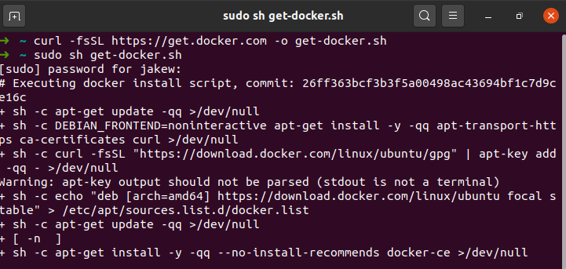
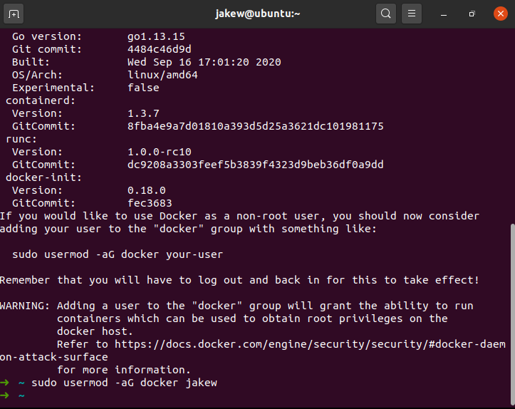
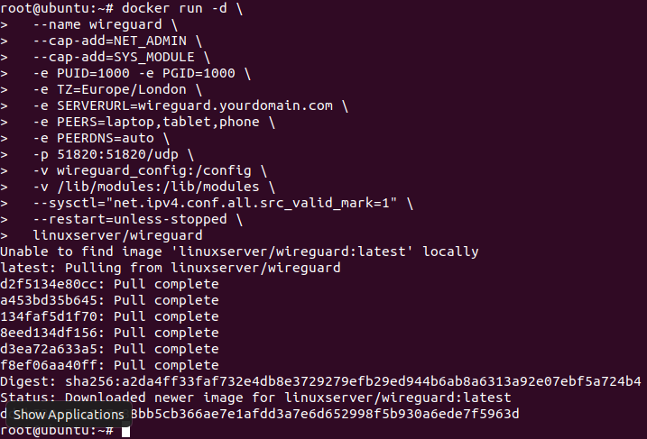
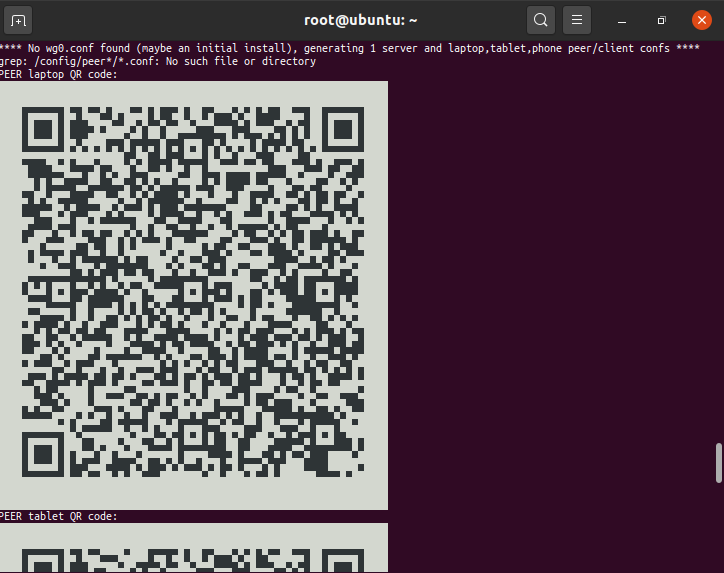

I'm a big fan of Docker, it really easily lets you set up applications without much effort and keeps everything organised on my server. I already run an OpenVPN server for the few times that I find myself on public Wi-Fi these days and I've been wanting to replace it with WireGuard which seems like a better solution.

> It intends to be considerably more performant than OpenVPN. [...] It might be regarded as the most secure, easiest to use, and simplest VPN solution in the industry.

I've heard more and more good things about WireGuard, so I thought it would be finally a good time to switch over this weekend.

I set up WireGuard on my existing Linux cloud server, but this could also be replicated on a Raspberry Pi at home if you don't want to splash cash on a cloud server.

## Installing Docker

These Docker installation instructions will only work on Linux machines, if you are working on Windows or macOS go to the Docker website for instructions on [downloading Docker Desktop](https://www.docker.com/get-started).

This two-liner installs Docker on most major Linux distributions.

```bash
curl -fsSL https://get.docker.com -o get-docker.sh
sudo sh get-docker.sh
```



After installing Docker, you will need to add your user to the `docker` group to allow you to run Docker commands without using sudo or logging in as a root user.

```shell
sudo usermod -aG docker <username>
```



You will most likely need to sign out and in again (or restart your SSH session) in order to be able to run Docker commands.

## Setting up WireGuard

Now that Docker has been installed, we can move on to setting up the VPN itself. For this, it is best to have a domain pointing to your machine that you can use for VPN purposes. If you do not have one, use `auto` instead of a domain in the command below.

You will also need to know how many devices that you will have that will use the VPN at the same time. In my case, I have a laptop, tablet and phone that could be using the VPN at the same time. From these devices, you will need to make a comma separated list of device names (e.g. `laptop,tablet,phone`) these can be named anything you'd like.

Now run the command below. Make sure to put your domain in for `SERVERURL=` and your list of devices for `PEERS=`.

```shell
docker run -d \
  --name wireguard \
  --cap-add=NET_ADMIN \
  --cap-add=SYS_MODULE \
  -e PUID=1000 -e PGID=1000 \
  -e TZ=Europe/London \
  -e SERVERURL=wireguard.yourdomain.com \
  -e PEERS=laptop,tablet,phone \
  -e PEERDNS=auto \
  -p 51820:51820/udp \
  -v wireguard_config:/config \
  -v /lib/modules:/lib/modules \
  --sysctl="net.ipv4.conf.all.src_valid_mark=1" \
  --restart=unless-stopped \
  linuxserver/wireguard
```

Here's what all of that means:

- **`--name wireguard`** - This names the container which makes it easier for using in commands later (rather than using the container's ID).
- **`--cap-add=NET_ADMIN --cap-add=SYS_MODULE`** - This gives the container extra permissions on the host system. Specifically, it is allowed to modify network interfaces and install kernel modules respectively (more on that below).
- **`-e ...`** - Each of the `-e` arguments sets an environment variable inside the container, these are used to configure the application that is running inside the container.
- **`-p 51820:51820/udp`** - This listens for traffic on UDP port 51820 (left of the colon) on the host and passes it through to the container on port 51820 (right of the colon). If something else was using that port, you could change the one on the left of the colon to something else (for WireGuard, you'd also have to set `-e SERVERPORT=` to reflect the new port too)
- **`-v wireguard_config:/config`** - This mounts the `/config` folder in the container to a Docker volume called `wireguard_config` (this could also be changed to a folder on the host, for example `/home/jakew/wireguard`). This particular volume would be stored at `/var/lib/docker/volumes/wireguard_config/_data`.
- **`-v /lib/modules:/lib/modules`** - This is the same as before, but we are just mounting the folder `/lib/modules` to the same place on the host (more on that below).
- **`--sysctl="net.ipv4.conf.all.src_valid_mark=1"`** - This sets a kernel parameter.
- **`--restart=unless-stopped`** - This makes sure that the container starts again on crashes and host restarts (unless it is manually stopped in which case it will not be started again when the host reboots).
- **`linuxserver/wireguard`** - This is the image that is being used. This is the name of the image which will be downloaded from Docker Hub which is a repository of Docker images.

Pressing enter will pull (download) the image and start the container in the background. You will get a long string of characters which is the container's ID. The VPN will initially take a little while to start up.



### Why the SYS_MODULE and /lib/modules?

The reason that the VPN takes a little while to start up for the first time and the reason that we give the container permission to install kernel modules and mount the `/lib/modules` folder is because WireGuard is actually run inside the Linux kernel. This is why it has such great performance and security.

### Getting client configurations

WireGuard will generate a configuration for each peer that we defined earlier on. These configurations contain connection information like the IP/domain of the VPN server and certificates for authentication.

The easiest way to get the client configuration onto your device is to scan the generated QR codes when the container starts. These are only shown on the first run, so if you missed them you'll need to get the files instead. We can look at them by using the following command and simply scanning the QR code with your phone or tablet.

```shell
docker logs wireguard
```



It's best to also save the configurations to your local machine so that you have them for future use. To use these, simply open the `.conf` file onto your device and open it in the WireGuard app. This command will copy the configurations to your home directory.

```shell
sudo cp /var/lib/docker/volumes/wireguard_config/_data/peer*/*.conf ~
```

Now set up a device with a configuration and make sure that it works correctly. If it connects it will most likely be working properly, but it might be worth checking your IP address to make sure that it matches what you would expect (e.g. the IP address of your cloud server).

## Setting up automatic updates

Although the VPN is now working, it may be worth setting up automatic updates to make sure you have the best security. There is a tool called watchtower that is run inside a Docker container that checks all of your other Docker containers for updates and will automatically download the update and restart the container seamlessly.

```shell
docker run -d \
           --name watchtower \
           -v /var/run/docker.sock:/var/run/docker.sock \
           containerrr/watchtower wireguard
```

If you have more containers that you would like to keep updated, it would be worth checking out the [watchtower documentation](https://containrrr.dev/watchtower/) to make sure that you have it set up properly for how you would expect. I have mine set up by adding a label to each container that I would like to have updates on and leaving critical containers to be updated manually. You can also configure other useful things like notifications when containers get updated.

## Wrap Up

Maybe the ease of setting up this VPN has shown you how cool Docker can be. I have become a big fan of it over the last couple of years that I've been experimenting with it.

I haven't had much time to test out WireGuard yet except quickly at home, but I can notice that it's slightly more snappy than OpenVPN when browsing websites. The app is much more simple though and much more easy to use with just one tap to turn on the VPN after set up.
