A few years ago, I had cheap 'smart' light bulbs in my room which were controlled with a remote control. To make them smarter, I decided to make an internet-connected Arduino relay the commands for turning the lights on and off, and changing the colour. I think I then hooked them up to [Home Assistant](https://www.home-assistant.io) so that I could control them through my Alexa or phone.

Eventually I moved away from those light bulbs, as they were so cheap that I ended up not being able to see some things when it was dark. For various reasons, I went for [IKEA's Trådfri](https://www.ikea.com/gb/en/cat/smart-lighting-36812/) ecosystem, rather than the more expensive (at the time), [Phillips Hue](https://www.philips-hue.com/en-gb). These days there's lots more good quality choices, but I'm still very happy with my IKEA lights.

After a recent trip to IKEA, I bought some new Trådfri gadgets, like [a plug](https://www.ikea.com/gb/en/p/tradfri-wireless-control-outlet-00364477/) and [a motion sensor](https://www.ikea.com/gb/en/p/tradfri-wireless-motion-sensor-white-70429913/). I thought the motion sensor would be good for turning the lights off if I'm not in the room. But I didn't do any research before buying it, so I wasn't sure how it would work. After getting home and setting it up, it turned out that the motion sensor turned the lights on if there was movement, and off if there was no movement. That's alright for most use cases, but I wanted it in my bedroom, and I don't really want it turning the lights on and off while I was sleeping, so my motion sensor has been sitting doing nothing for a few months.

## Z-Wave and Zigbee

Earlier this week, I was inspired by [a video by Linus Tech Tips](https://www.youtube.com/watch?v=xm740EdgOTM) where he was showing his idea for smartening up his home with [Home Assistant](https://www.home-assistant.io). He is using [Z-Wave](https://www.z-wave.com) light switches around his house so he can control ordinary lights from a phone or voice assistant. The light switches also have motion sensors inside them, so they can detect if nobody is in the room, and turn off the lights.

Z-Wave is a standard for smart home devices, which creates a mesh network, meaning each device will relay messages to devices that are further away from the gateway. Z-Wave check every device to ensure that it has a good standard of security and quality.

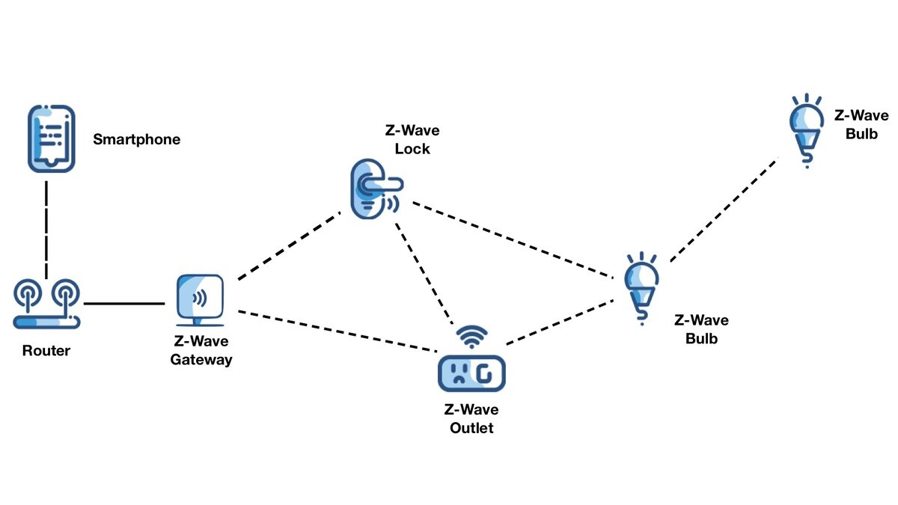

There is also a similar standard called [Zigbee](https://zigbeealliance.org/solution/zigbee/). Zigbee do not check every device which makes it a more open standard. Zigbee devices are much cheaper than a similar Z-Wave one. IKEA Trådfri devices are actually using Zigbee under-the-hood, so theoretically, you can actually buy any Zigbee gateway and pair a Trådfri gadget to it.

After a quick Google search to make sure that it was possible, I thought that it would be a great idea to use my Trådfri motion sensor directly with a Zigbee gateway, so I could get more control over what it does.

## The Dongle

Buying a Zigbee dongle with Home Assistant seemed like the best way to move forward.

After a search on Amazon, I found [this cheap dongle](https://www.amazon.co.uk/Aideepen-Protocol-Analyzer-Assistant-Bluetooth-multicolor/dp/B08F9F276S) which had the word 'Home Assistant' in the title, so surely it should work with Home Assistant right? That's what I thought, so I bought the dongle, and [a cheap temperature and humidity sensor](https://www.amazon.co.uk/SNZB-02-Temperature-Humidity-Compatible-Including/dp/B08BFW697F) to bring my order up to the free shipping limit.

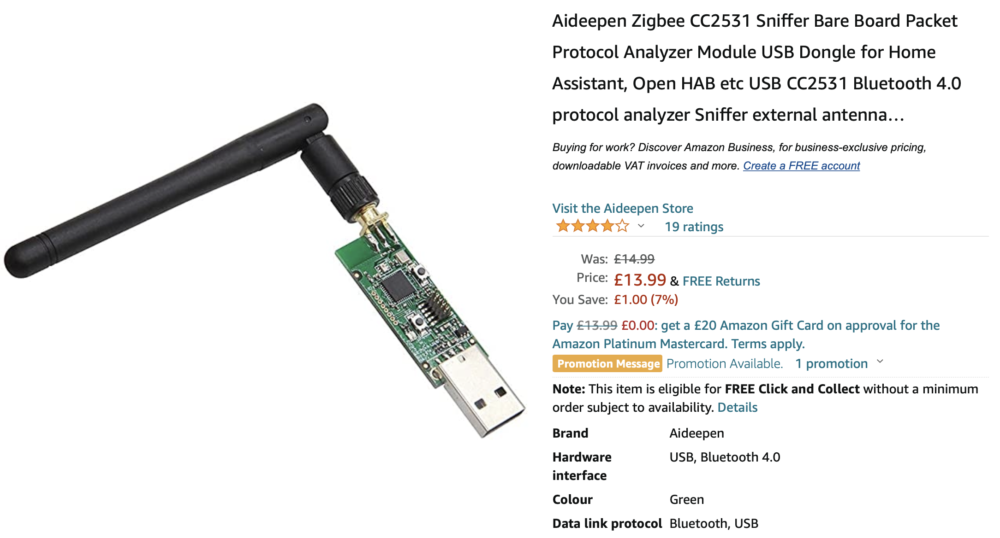

Unfortunately, I missed the sentence in the description of the dongle's product page which said "After flashing the firmware [...] it can work with Zigbee2mqtt". I eventually found out that I would need to flash it after plugging it into my computer and not seeing anything come up (I was expecting a serial port), which means that it would need flashing before it would work.

> If you end up buying a dongle, I would recommend buying a pre-flashed one **and** a slightly more powerful one, as I later found out mine can't handle networks over 50 devices. That shouldn't be a problem, but it's nice to be future-proof.

## Flashing the Dongle

As I found out, my dongle needed flashing with firmware that would let it work with Home Assistant. You can follow the instructions from the Zigbee2MQTT project [here](https://www.zigbee2mqtt.io/information/flashing_the_cc2531.html). Even though I'm not using that project, the instructions are still valid.

After looking at the instructions, I saw that I would need to buy a debugger and special cable to flash the dongle. I didn't fancy buying those for a one-time job, so I tried looking at the more janky [alternative flashing methods](https://www.zigbee2mqtt.io/information/alternative_flashing_methods.html). I went down the Raspberry Pi route, so I wouldn't have to install anything on my laptop.

### Brief Flashing Instructions with a Raspberry Pi

_These instructions are shortened from the Zigbee2MQTT website, make sure to check them out if you would like more detail._

Below is the pinout of the dongle from the product page. You do not need to connect pin 2 (Vdd) if you plug the dongle into USB.

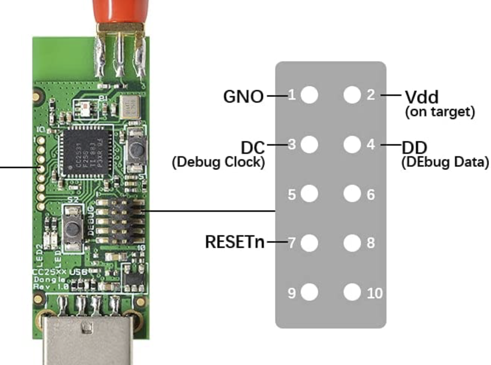

The debug pins on the dongle are very tightly packed together, so to be able to fit crocodile clips on them without shorting out, I needed to bend the pins to the side. Only 4 of the 10 pins need to be connected, so they don't need to all be bent. I was quite worried I would snap the pins, so be careful if you take this approach.

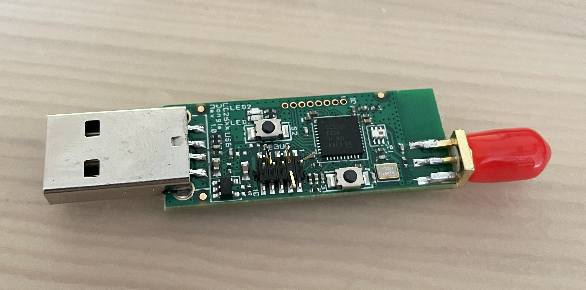

Here is my dongle connected to the Raspberry Pi with crocodile clips. The wires are stuck down to stop them from moving around accidentally and shorting.

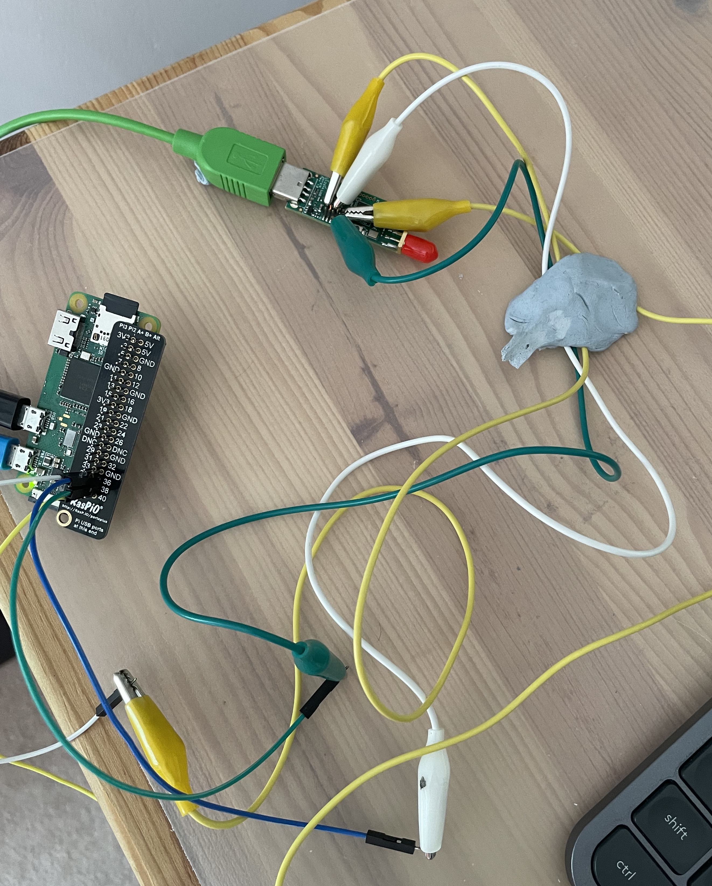

After connecting up the dongle, and nothing blowing up, I moved onto actually flashing it with the instructions below.

```bash
# Install dependencies
sudo apt update
sudo apt install wiringpi git -y

# Download flashing scripts
git clone https://github.com/jmichault/flash_cc2531.git
cd flash_cc2531

# Checking the chip ID
./cc_chipid  # Should return b524, if not your wiring could be wrong

# Download the firmware
wget https://github.com/Koenkk/Z-Stack-firmware/raw/master/coordinator/Z-Stack_Home_1.2/bin/default/CC2531_DEFAULT_20201127.zip
unzip CC2531_DEFAULT_20201127.zip

# Flash the dongle
./cc_erase
./cc_write CC2531ZNP-Prod.hex
```

After about 3 minutes, the dongle will have flashed successfully. The dongle should now create a serial port when plugged into a computer.

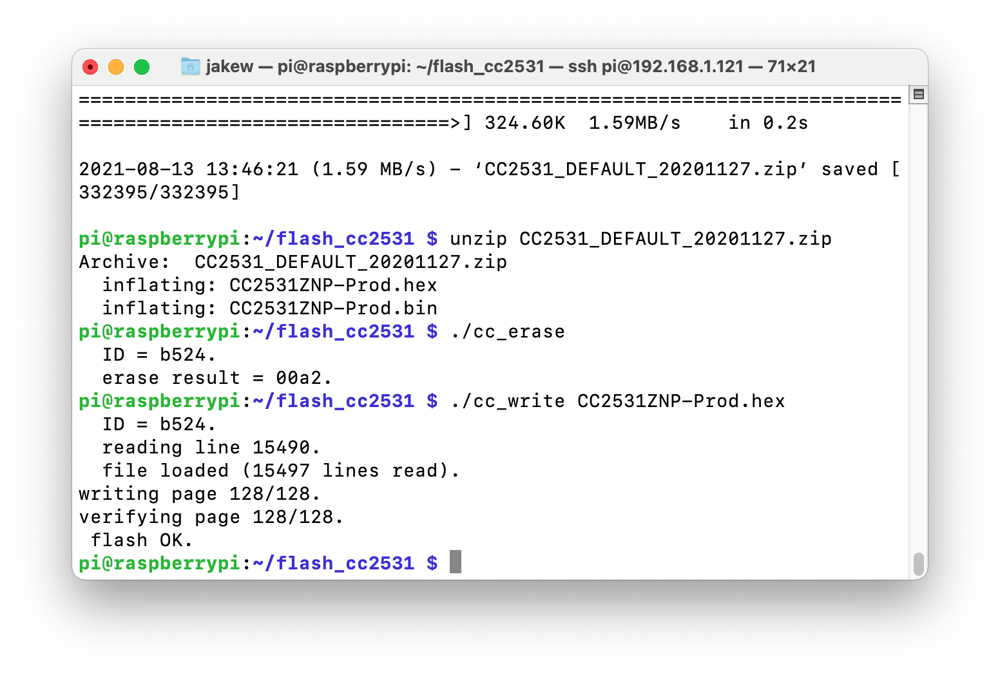

This picture shows the output of `dmesg` on Linux, which lets you see that the CC2531 dongle has been detected and assigned serial port `/dev/ttyACM0`.

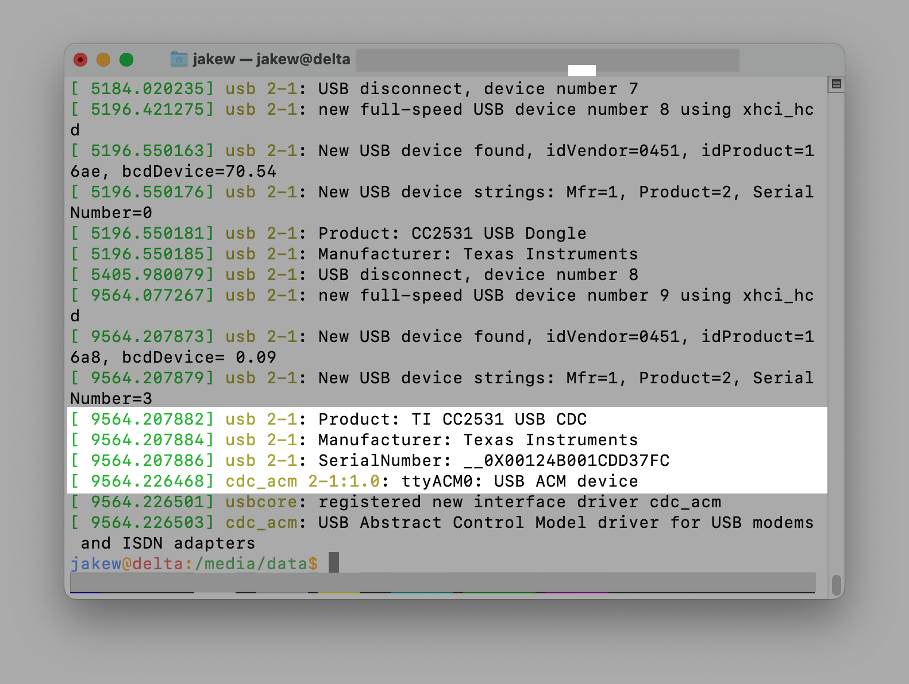

## Setting up Home Assistant

Now the dongle is good to go, it's time to setup Home Assistant. I'm going to walk through setting up Home Assistant inside a Docker container because I find it a little bit easier. I'm using an old laptop as a server, but I'd recommend a Raspberry Pi if you're not running much else.

Firstly, you will need to install Docker and Docker Compose:

```bash
# Install Docker
curl -fsSL https://get.docker.com | sh

# Install Docker Compose
sudo apt update
sudo apt install docker-compose -y

# Add yourself to the docker group
sudo usermod -aG docker $USER
```

Now Docker is installed, we'll make a new folder for storing the Docker Compose file (which is like a recipe for creating Docker containers).

```bash
# create a new folder in your home folder
mkdir ~/homeassistant
cd ~/homeassistant

# open docker-compose.yml for editing
nano docker-compose.yml
```

Inside the `docker-compose.yml` file, put the following. Notice that under `devices`, `/dev/ttyACM0` is being passed into the container, this is so Home Assistant can use the dongle. You may need to change the device that is being passed in, you can check by looking at the output of `dmesg` as shown in the previous section. Also, this container uses `network_mode: host` which essentially means no network isolation is in place, this is important so that Home Assistant can more easily advertise itself to other things on your network (e.g. for the HomeKit integration).

```yaml
version: '3.4'
services:
    homeassistant:
        container_name: homeassistant
        restart: unless-stopped
        image: ghcr.io/linuxserver/homeassistant
        network_mode: host
        environment:
            - PUID=1000
            - GUID=1000
            - TZ=Europe/London
        devices:
            - "/dev/ttyACM0:/dev/ttyACM0"
        volumes:
            - "./config:/config"
```

Save the file, then start up the container:

```bash
docker-compose up -d
```

After starting up the container, go to port 8123 to see the Home Assistant dashboard and follow the instructions to get set up.

## Setting up Zigbee in Home Assistant

Once into Home Assistant, head to 'Configuration' on the sidebar, then 'Integrations'. In the bottom right, click 'Add Integration' and search for 'Zigbee'. You should see 'Zigbee Home Automation' come up.

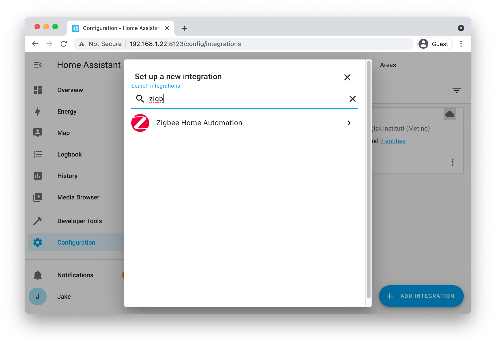

You should be prompted to select the serial port. You should see the device that was passed in from the Docker Compose file, and the chipset of the dongle, which in my case is CC2531.

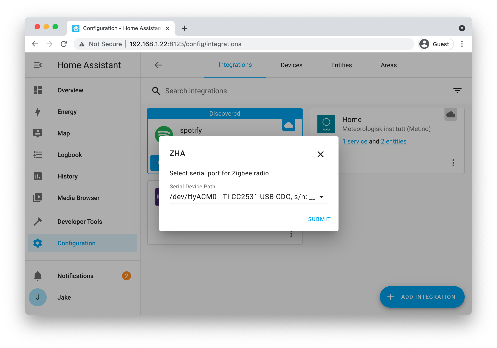

If you don't get prompted to add a device, you can click on the devices link underneath Zigbee Home Automation on the Integrations page, then 'Add Device' in the bottom right. You will then be asked to put your device into pairing mode. You will need to follow your specific devices instructions for that.

### Temperature and Humidity Sensor

I first tried to setup my temperature and humidity sensor. I bought this because **I know** that it works with Zigbee, and should help me troubleshoot whether my Trådfri device isn't working or whether the Home Assistant or Zigbee dongle isn't working.

Following the instructions for it, I put into pairing mode, and a red light began to flash.

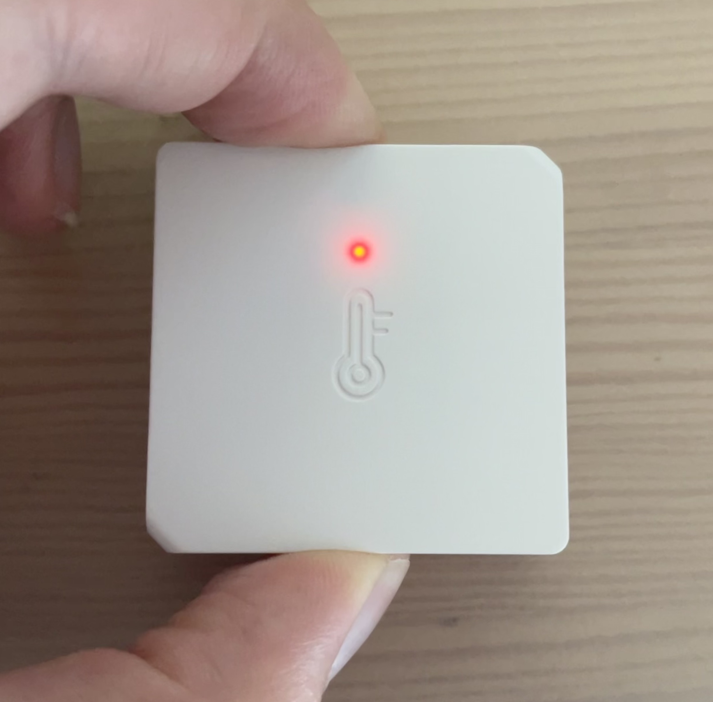

Almost instantly, the device was detected in Home Assistant. It takes just under a minute for it to be fully 'interviewed', where the device is asked what information it can give.

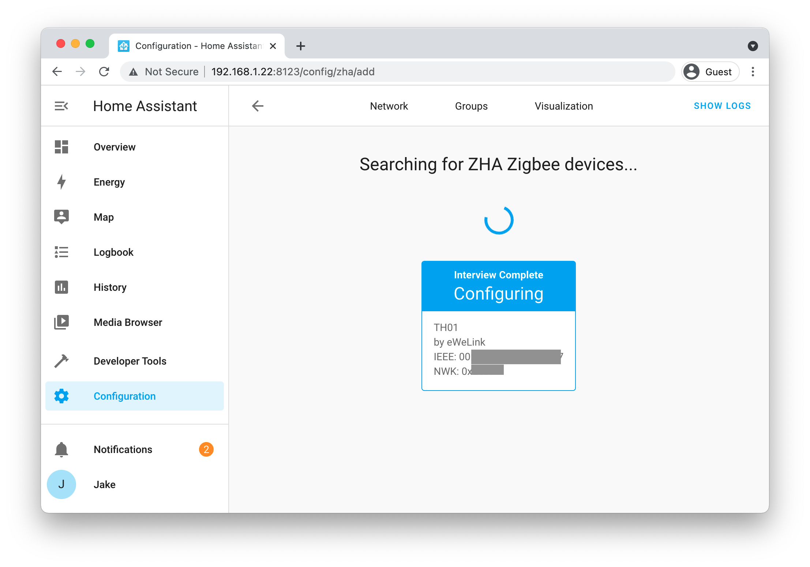

The temperature and humidity are now shown on the Overview page.

### Trådfri Motion Sensor

Now for the main event, the motion sensor that has been sitting on my desk for months.

The motion sensor can be put into pairing mode by pressing the link button on the back 4 times. This process is similar for other Trådfri devices with buttons, otherwise for things like light bulbs without buttons, they need to be reset. It's worth Googling if your not sure, there's lots of documentation out there for connecting these Trådfri devices to a Zigbee gateway.

The motion sensor shows a red light, to indicate it is in pairing mode, just like the temperature sensor.

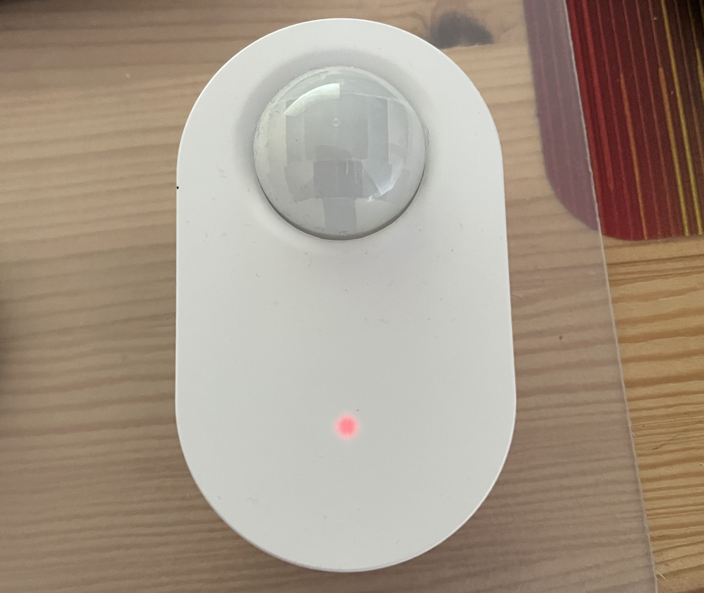

The motion sensor also gets instantly picked up by Home Assistant, and after the quick interview process, shows up in the Overview tab.

## Next Steps

Inside Home Assistant, the temperature and humidity sensor has 3 separate 'entities', one for the temperature reading, one for the humidity reading and one with the battery level. The motion sensor has 2 'entities', one indicating whether there is motion or not, and the other with the battery level.

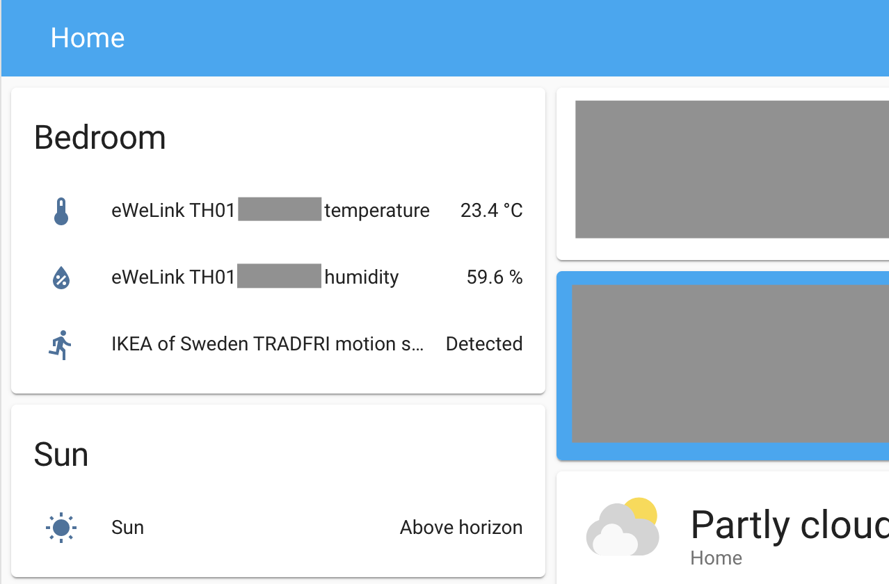

The motion sensor now gives me a lot more control, I can setup automations within Home Assistant which can use the motion sensor to do things. For example, I could make it so that if the light is on, and no motion has been detected for 5 minutes, the light turns off. That way, if I'm sleeping, the light won't turn on when it detects motion. I haven't gotten around to setting up automations yet, because I'm having some issues (more on that below), although I expect I will do a blog post if I learn anything cool about them.

In the future, I might also switch over all of my IKEA lights over to use Home Assistant, depending on how well the reliability holds up.

I hope this post has inspired you to look into home automation and smart devices. I'd love to know if you do anything cool!
