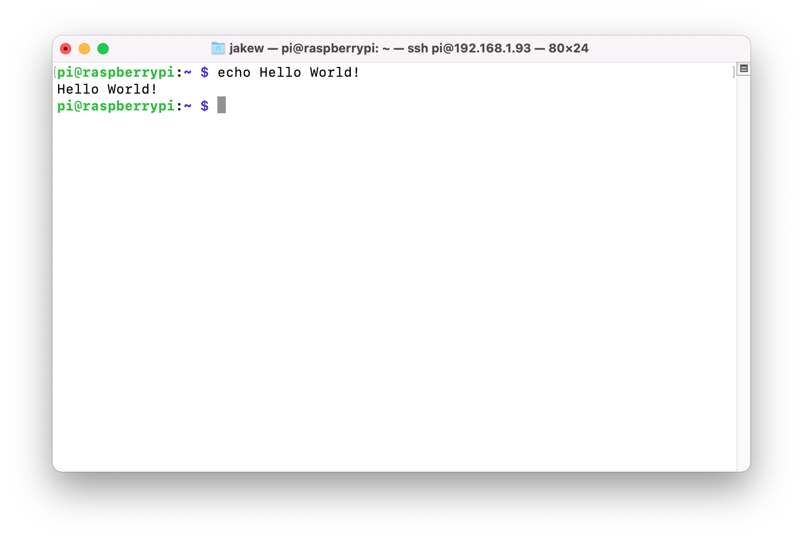
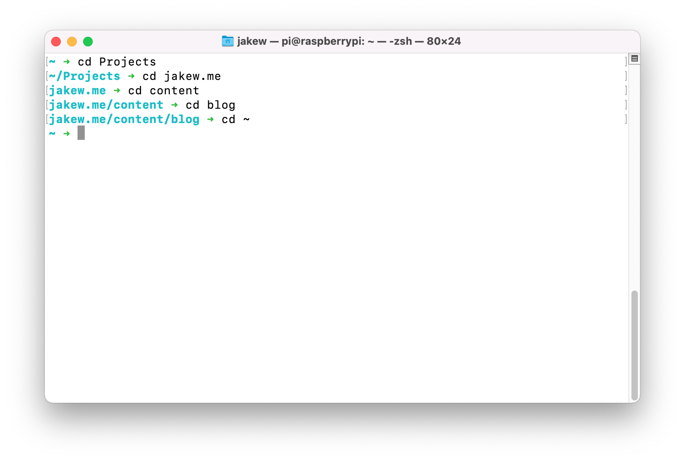

[Starship](https://starship.rs) is a cool little open-source project, which gives you a nice customizable prompt for your shell.

## What is a prompt?

A prompt is the text at the start of your shell/terminal that tells you that you need to type a command. Usually it's something boring like this (the `pi@raspberrypi:~ $`):



## Installing Starship

### Linux

Simply run this one-liner, to install Starship.

```bash
sh -c "$(curl -fsSL https://starship.rs/install.sh)"
```

You then need to add the init script to your shell config. This is usually bash, but on some distros could be zsh or something else.

```bash
# For bash
echo 'eval "$(starship init bash)"' >> ~/.bashrc
source ~/.bashrc

# For zsh
echo 'eval "$(starship init zsh)"' >> ~/.zshrc
source ~/.bashrc
```

### Windows (PowerShell)

On Windows, the easiest way to install Starship is using Chocolatey, a package manager for Windows. Although, if you prefer to not install that, there are other ways listed [here](https://starship.rs/guide).

```powershell
# Install Chocolatey
Set-ExecutionPolicy Bypass -Scope Process -Force; [System.Net.ServicePointManager]::SecurityProtocol = [System.Net.ServicePointManager]::SecurityProtocol -bor 3072; iex ((New-Object System.Net.WebClient).DownloadString('https://community.chocolatey.org/install.ps1'))

# Install Starship
choco install starship -y

# Get the location of your PowerShell profile
echo $PROFILE
# e.g. /Users/jakew/.config/powershell/Microsoft.PowerShell_profile.ps1

# Create the directory
New-Item -ItemType Directory /Users/jakew/.config/powershell/

# Add the init script to the profile
echo "Invoke-Expression (&starship init powershell)" >> $PROFILE

# Reload the profile
& $PROFILE
```

### MacOS

Simply install Starship with brew on MacOS. Then add the init script to your zsh config.

```bash
brew install starship
echo 'eval "$(starship init zsh)"' >> ~/.zshrc
source ~/.zshrc
```

## Customize!

Now already after installing, your prompt should look a lot more interesting than before. I'm not a huge fan of all the extra stuff though, like the Python version when in a Python project, I could just run `python --version` if I needed.

You can edit **`~/.config/starship.toml`** to configure how Starship looks. You can see the options available [here](https://starship.rs/config/), but this is my go to configuration which is very minimal:

```toml
add_newline = false
format = """$username\
$hostname\
$directory\
$character
"""

[character]
success_symbol = "[➜](bold green)"
error_symbol = "[➜](bold red)"

[username]
format = "[$user]($style)"

[hostname]
format = ":[$hostname]($style) "
```

The format variable sets the order of what is displayed. In this case, I have the username, hostname, directory and then character. The character I have set so that it is usually green, but goes red when the last command failed. The username and hostname only show when SSHing in.

Even though I could do this by changing my shell's prompt variable, I like Starship because there is a lot more control over things and does some things better. For example, you can see the path here changes where it is relative to once I enter my Git repository, whereas the default prompt might only show 2 directories higher:



I find if I have no GUI whatsoever (e.g. on a headless Raspberry Pi), it's useful to turn on some of the other bits, like [Git](https://starship.rs/config/#git-branch), [memory usage](https://starship.rs/config/#memory-usage), [time](https://starship.rs/config/#time) or perhaps [sudo](https://starship.rs/config/#sudo).

Thanks for reading, hopefully this very short blog post helped you make your shell feel more at home.
