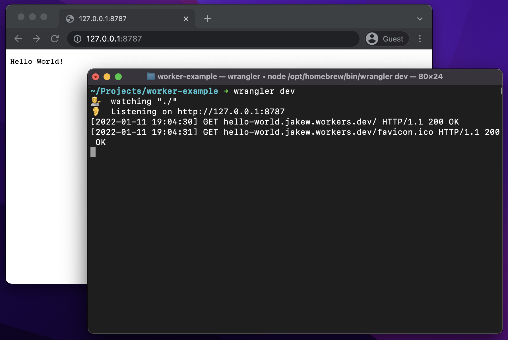
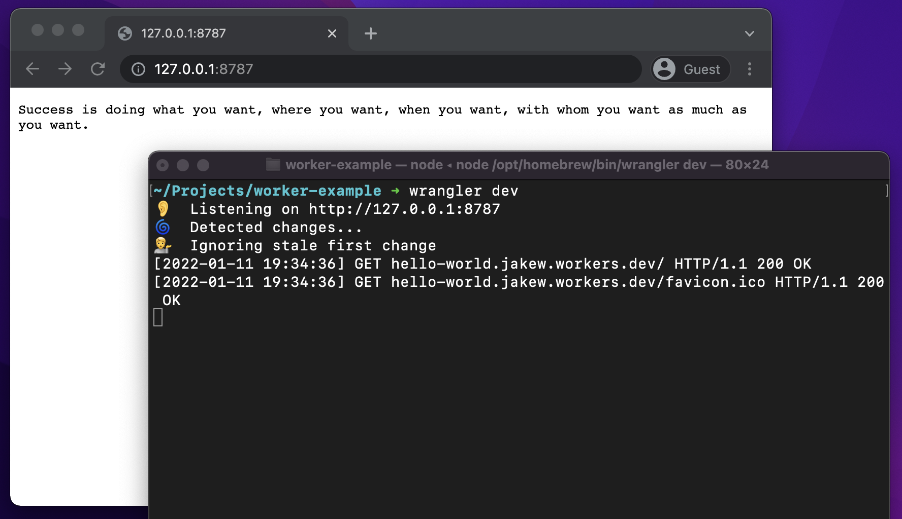
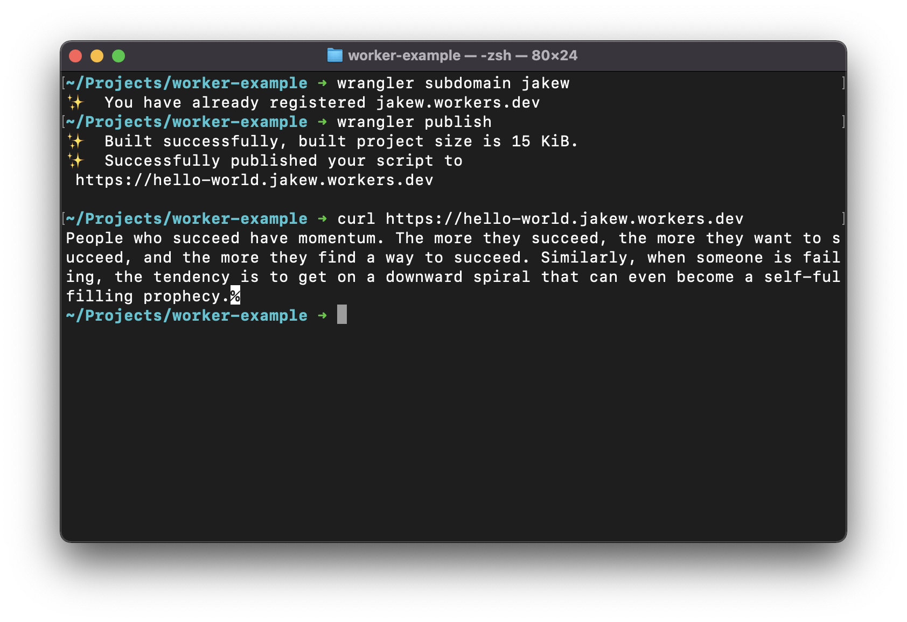

One of my new favorite services is Cloudflare Workers. It's a platform for running serverless code with quite nice developer experience. In this post, I'd share what I like so much and how you can get started.

Firstly, what is serverless? Serverless is a way of deploying code to the cloud where you do not manage the infrastructure, it is all managed by your chosen provider. With serverless, you only pay for the time that your code is executed which makes it great for applications that get low traffic or only get used certain times. Instances of your code are created and destroyed on demand which your code can 'infinitely scale'.

Sounds great right? Let's have a deeper look. If you're not too interested in the details, [skip down to the code](#writing-your-first-function).

## Serverless Benefits vs. Other Methods
To put that into context, let's talk about some of the ways you might deploy some code that you have written.

One of the obvious options is to rent a virtual machine or dedicated server from a hosting company. This gives you a **lot of control**, you get to install any operating system that you want and fine tune the power you need (like wanting  more CPU over RAM). The provider of the machine is maintaining the actual hardware, networking, cooling and other things. The downside for virtual machines, are that you need to **constantly maintain** this machine, updating the OS, deploying new code, etc...

Another option might be to use something like [Heroku](https://www.heroku.com) or [AWS Elastic Beanstalk](https://aws.amazon.com/elasticbeanstalk/) where you just upload your code to the platform, and it gets **provisioned onto machines by the provider**. This gives you **less control** over the hardware that your code is running on, usually just the environment (i.e. the version of runtime your code runs and dependencies, not the operating system). The provider is responsible for the physical hardware as well as the operating system. Most providers offer Continuous Deployment which will automatically deploy any new versions of code.

The last option might be serverless, using something like [Cloudflare Workers](https://workers.cloudflare.com) or [AWS Lambda](https://aws.amazon.com/lambda/). Similarly to the last option, you only upload your code to the platform and the provider sorts out the servers and running of the code. You usually get even less control over serverless, where the provider might only allow certain runtimes or no choice at all. You are usually limited on the size of your code too, 50MB on AWS Lambda, and 1MB on Cloudflare Workers. However, the big benefit of serverless is that you only pay for the time your code is running, this makes it great for applications that have light traffic or traffic at only certain times in the day. With some providers, you get 'infinite' scaling, so more and more instances of your code will be created as necessary to saturate the incoming requests. _There are other pros and cons depending on the provider, but those are some of the major ones._

## Why Cloudflare Workers?
Cloudflare released Workers back in September 2017 (with public access in March 2018), which is relatively new compared to AWS who have been offering their serverless Lambda functions since November 2014.

### Runs Globally
Cloudflare run Workers at their existing **edge locations**, which are data centers which are placed close to end users so they can offer **fast, snappy responses**. By comparison, if you used AWS Lambda, your function would be limited to a single region, if someone from the other side of the world made a request, they'd get a slow response. Cloudflare would give great performance anywhere in the world.

_I should point out, AWS offers a product called Lambda@Edge, which runs at edge locations, but I can't find much information on them. If you're interested Cloudflare has some good articles comparing like [this one](https://www.cloudflare.com/en-gb/learning/serverless/serverless-performance/)._

### Fast Startups
Cloudflare Workers have **extremely fast startup times**, usually milliseconds after a request, where other providers have seconds or minutes. This is very important for user experience, especially since 10 seconds is the limit for people keeping attention on the ongoing interaction.

> "After 1 second, users get impatient and notice that they're waiting for a slow computer to respond. The longer the wait, the more this impatience grows; after about 10 seconds, the average attention span is maxed out. At that point, the user's mind starts wandering and doesn't retain enough information in short-term memory to easily resume the interaction once the computer finally loads the next screen."
>
> \- [Jakob Nielsen](https://www.nngroup.com/articles/author/jakob-nielsen/) ([source](https://www.nngroup.com/articles/powers-of-10-time-scales-in-ux/))

Other providers, like AWS Lambda, tend to use lightweight containers for running code, these provide a secure environment for running untrusted code. Once a request comes in, a container is started and takes a few seconds to boot up (this is called a slow start). Any subsequent requests will use the existing container running the code so a response is sent back quickly. Once there are no requests for a while, the container is destroyed. In summary, any new requests often need to wait for a container to start, but any subsequent requests are much faster.

Cloudflare achieves super fast startup times because they run code in 'Isolates', which are a way of running lots of JavaScript functions independently while using a single runtime. They always have the runtime ready which means there are almost zero startup times. A downside of this approach is that you **can only run JavaScript code** on Cloudflare Workers, however you can compile other code into [WebAssembly](https://webassembly.org) so that it can run in a Worker (WebAssembly unfortunately has lower performance than running native code).

### Affordable Pricing & Generous Free Tier
Cloudflare gives 100,000 requests for free each day, with any extra requests being charged at $0.15 per million requests (with a minimum of $5/month). AWS, for comparison, gives you 1 million requests each month, but charges $0.20 per million for anything over ($0.60 per million for Lambda@Edge).

<small><i>
Prices as of 4th Jan 2022 in the UK West (Ireland) region for AWS. I am ignoring execution time pricing here as there's more considerations than just price for it. Cloudflare bundles them into their price up to a certain amount and have only one option for memory (128MB). AWS charges execution time for each request.
</i></small>

### Summary
Cloudflare Workers has great performance around the world, have affordable pricing and a great free tier. This all makes Workers a great offering in the serverless space, but there's still advantages for going elsewhere.

## Writing your first function
To get started, you will need [Node.js](https://nodejs.org/en/) installed on your machine and a new folder for your project.

I'm going to be using [Yarn](https://yarnpkg.com) which is package manager for Node.js which I like to use.

### Installing Wrangler CLI

First, you will need to install the Wrangler CLI. This is a tool which Cloudflare has made for deploying code to Cloudflare Workers as well as working with some other Cloudflare services. After installing the CLI, you will need to login to your Cloudflare account.

```bash
yarn global add @cloudflare/wrangler
wrangler login
```

_If you get an error saying Wrangler is not found, you may need to add the Yarn bin directory to your path. Get the path of the Yarn bin with `yarn global bin`. For more information see [here](https://stackoverflow.com/questions/40317578/yarn-global-command-not-working)._

### Creating a new project

Next up, you will need to make a new Yarn project.

```bash
yarn init --yes
```

Now create a file called `wrangler.toml`, this is the configuration file that tells Wrangler what to do with this project.

```toml
name = "hello-world"
type = "webpack"

account_id = ""
workers_dev = true

compatibility_date = "2022-01-11"
```

`type` can be `javascript` or `webpack`. Webpack means you can use Node.js packages in your project. The `compatibility_date` is the set of features that are enabled for your project.

Then, create a file called `main.js` with this code. This simply listens for new requests and responds with 'Hello World!'.

```js
addEventListener('fetch', (event) => {
  event.respondWith(new Response("Hello World!"));
});
```

At this stage, you can run `wrangler dev` and open `http://127.0.0.1:8787` to see your message.



Great, you've just written your first Cloudflare Worker!

### Using npm packages
As with most Node.js projects, you will probably want to make use of some npm packages. As an example, I'll show using a package which will return an inspirational quote.

First, install the package.

```bash
yarn add inspirational-quotes
```

Then, use it in your code like normal. In this case, we import the package at the top of the file and return the output of one of the functions.

```js
const quotes = require('inspirational-quotes');

addEventListener('fetch', (event) => {
  const quote = quotes.getRandomQuote();
  event.respondWith(new Response(quote));
});
```

Running the development server again, the response is now an inspirational quote!



### Publishing
Finally, we can publish this project. Cloudflare gives you a free `workers.dev` domain which you can publish your Workers to, however you can also publish to another domain that you manage on Cloudflare.

Simply, choose a subdomain and then publish. You only need to run the subdomain command once.

```bash
wrangler subdomain <name>
wrangler publish
```

You will then be given the URL of your published Worker! Notice the start of the domain is the `name` value in your `wrangler.toml` which in this case is `hello-world`.


That's it, you have just written and published your first Cloudflare Worker and perhaps your first serverless code!

I hope this post was useful and inspired you to check out Cloudflare Workers. I'm going to continue this adventure with my next post on Cloudflare Workers KV, a way of storing persistent data in a Cloudflare Worker.
